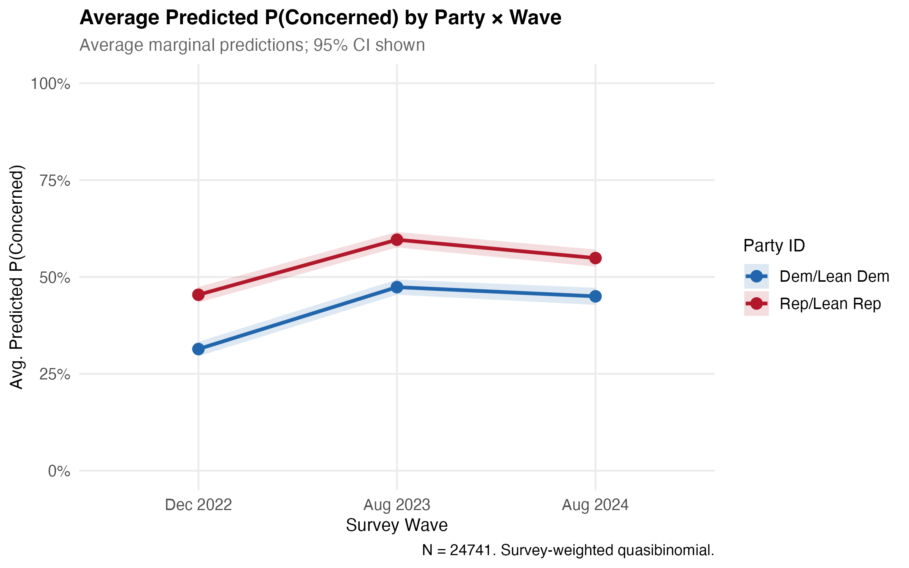

# The Politicization of Workforce Futures: Occupational Identity Threat and the Partisan Divergence of AI Attitudes in the United States, 2022--2024

Hosung You

Department of Learning and Performance Systems, Pennsylvania State University

**Author Note**

Hosung You, Department of Learning and Performance Systems, College of Education, Pennsylvania State University, University Park, PA 16802, United States.

Correspondence concerning this article should be addressed to Hosung You, Department of Learning and Performance Systems, Pennsylvania State University. Email: hosung@psu.edu

\newpage

## Abstract

**Purpose.** This study examines how political identity shapes public attitudes toward artificial intelligence (AI) in the United States during a period of rapid AI diffusion (2022--2024), applying occupational identity threat theory and loss aversion to explain the partisan structure of AI concern.

**Design/methodology/approach.** The study analyzes three waves of the Pew Research Center American Trends Panel (December 2022, raw *N* = 11,004; August 2023, raw *N* = 11,201; August 2024, raw *N* = 5,410; analytic *N* = 24,741 after listwise deletion and restriction to partisan leaners). Survey-weighted binary logistic regression, wave-by-demographic interaction models, average marginal effects, and Blinder-Oaxaca decomposition decompose the determinants and temporal dynamics of AI concern.

**Findings.** Public concern about AI surged from 38.2% to 53.2% between December 2022 and August 2023, with only modest retreat by August 2024 (50.9%). Republican/lean-Republican identification was the strongest demographic predictor of concern (OR = 1.55, *p* < .001), exceeding the effects of education, age, income, and AI awareness. The partisan gap narrowed significantly over time, however, falling from 12.5 percentage points in December 2022 to 7.0 percentage points by August 2024 (wave-by-party interaction *p* = .021). Blinder-Oaxaca decomposition confirmed that attitude change was driven almost entirely by shifting coefficient effects (106.1%), not compositional demographic changes (-0.8%).

**Practical implications.** Human resource development practitioners cannot treat AI adoption as ideologically neutral. Change management strategies must account for the political heterogeneity of workforce attitudes while building on emerging bipartisan convergence in concern as a platform for inclusive workforce development.

**Originality/value.** This study is among the first to theorize and empirically document the partisan structure of AI attitudes using nationally representative repeated cross-sectional data, introducing the concept of vicarious occupational identity threat to explain why political identity predicts AI concern more strongly than direct exposure or educational attainment.

**Keywords:** artificial intelligence, occupational identity threat, political polarization, loss aversion, workforce development, human resource development

\newpage

## Introduction

In eight months, the share of Americans who said they were more concerned than excited about artificial intelligence jumped from 38% to 53%. That 15-point surge, captured across two waves of Pew Research Center data bracketing the release of ChatGPT, outpaced almost any comparable shift in public technology attitudes on record. What makes the number more striking is what predicted it: not education, not age, not income, not even familiarity with AI, but partisan political identity. Republican-leaning respondents were 55% more likely than Democratic-leaning respondents to express concern (OR = 1.55, *p* < .001), and that gap held after adjusting for every conventional demographic variable in the model. Human resource development (HRD) practitioners designing AI adoption strategies need to reckon with this finding. The workforce they are preparing for an AI-transformed economy does not evaluate the technology on its technical merits alone; workers filter AI through identities shaped, in part, by partisan politics.

The speed and magnitude of the attitudinal shift demand explanation. Between December 2022 and August 2023, a period bracketing the public release of ChatGPT and the subsequent explosion of generative AI tools, the proportion of Americans expressing more concern than excitement about AI surged from 38.2% to 53.2%. Over that same window, those reporting more excitement than concern dropped from 15.5% to 10.3% [@pew2023]. This was not a gradual evolution. It was a rapid recalibration of public sentiment, concentrated in an eight-month window that coincided with intense media coverage, corporate AI investment announcements, and growing public discourse about AI-related job displacement [@pew2024]. By August 2024, concern had stabilized near its peak at 50.9%, pointing to a durable reorientation rather than a transient media-driven reaction.

Yet this aggregate trend obscures systematic variation that matters enormously for organizational practice. Existing research on technology attitudes has overwhelmingly relied on individual-level frameworks in the Technology Acceptance Model (TAM) and Unified Theory of Acceptance and Use of Technology (UTAUT) traditions, which emphasize perceived usefulness, ease of use, and performance expectancy as determinants of technology adoption [@hamlin2011; @ellinger2014]. These frameworks were designed for volitional adoption decisions within organizations. They do not capture the macro-level, identity-driven dynamics that characterize public attitudes toward a technology perceived as an existential threat to entire occupational categories. AI is not a software upgrade that workers evaluate in terms of task efficiency. It is a societal transformation. Consider a veteran paralegal who discovers that a large language model can draft the legal memoranda she spent a decade learning to write. Her concern is not about whether the tool is easy to use; it is about whether her professional life still means what she thought it meant [@parker2022; @jarrahi2018; @makridakis2017].

The political polarization of AI attitudes represents a particularly important gap in the HRD literature. Research in political science and science communication has established that political identity functions as a powerful heuristic for evaluating complex, uncertain, and value-laden issues, from climate change [@kahan2012] to vaccination to nuclear energy [@druckman2013; @bolsen2014]. Partisan information ecosystems further amplify these dynamics, as exposure to ideologically congruent media reinforces pre-existing frames [@guess2020], and even cross-cutting exposure can paradoxically deepen polarization [@bail2018]. AI has joined this set of politically charged issues. Republicans express substantially higher concern than Democrats even after accounting for differences in education, income, age, and AI familiarity [@pew2023; @schiff2024]. Yet no study has systematically theorized *why* political identity predicts AI attitudes, nor has any study tracked the temporal dynamics of partisan AI attitudes across multiple time points using rigorous, nationally representative data.

This study addresses these gaps by integrating two theoretical perspectives from organizational psychology and behavioral economics: occupational identity threat [@petriglieri2011] and loss aversion from prospect theory [@kahneman1979]. We argue that AI threatens occupational identities, that is, the meanings, values, and self-concepts that individuals derive from their work, and that this threat is differentially experienced and politically mediated. Through a mechanism we term *vicarious occupational identity threat*, partisan identity absorbs and amplifies occupational anxieties: Republican constituencies, increasingly identified with working-class occupational communities whose foundations AI threatens, experience AI concern as an extension of broader identity threat, while Democratic constituencies initially framed AI through an innovation lens before gradually adopting labor and inequality concerns. Loss aversion explains the asymmetry of the attitudinal shift. Concern, as a response to potential loss, surges faster and more dramatically than excitement, as a response to potential gain, can compensate.

Using three waves of the Pew Research Center American Trends Panel (ATP), collected in December 2022, August 2023, and August 2024, this study makes three contributions to HRD scholarship. First, it provides the first systematic analysis of partisan AI attitudes using nationally representative repeated cross-sectional data with survey weights, establishing the empirical pattern that political identity is the strongest demographic predictor of AI concern. Second, it introduces occupational identity threat as a theoretical framework for understanding AI attitudes, moving beyond the TAM/UTAUT paradigm that dominates technology attitude research in HRD [@alagaraja2003; @swanson2009]. Third, it documents a convergence pattern: the partisan gap in AI concern narrows over time. If both partisan camps are converging toward shared concern, HRD practitioners have an emerging bipartisan platform on which to build inclusive AI workforce development initiatives.

The study tests the following five hypotheses, derived from occupational identity threat theory and prospect theory, to structure the empirical investigation:

- *H1 (Loss-Gain Asymmetry)*: The magnitude of increase in AI concern will exceed the magnitude of decrease in AI excitement across waves.
- *H2 (Partisan Identity Threat)*: Republican/lean-Republican identification will predict higher AI concern even after controlling for education, age, income, and AI awareness.
- *H3 (Temporal Convergence)*: Does the partisan gap in AI concern narrow over time as Democrats increasingly express concern? We predict that it does, reflecting convergent identity threat pathways.
- *H4 (Demographic Stability)*: We expect no significant temporal divergence in education-based or age-based differences in AI concern across waves.
- *H5 (Composition vs. Coefficient)*: If the attitude shift is genuine rather than a sampling artifact, cross-wave changes in AI concern should be driven primarily by coefficient (behavioral) effects rather than compositional (demographic) changes in the sample.

## Theoretical Framework and Hypotheses

### AI Attitudes in the Post-ChatGPT Era

Public attitudes toward artificial intelligence underwent a dramatic transformation after the release of ChatGPT in November 2022. Before this inflection point, AI attitudes were characterized by moderate ambivalence. National surveys found that Americans held a mixture of cautious optimism and uncertainty about AI, with relatively few expressing strong concern or enthusiasm [@zhang2019; @pew2022]. International surveys documented similar patterns of measured ambivalence across developed democracies, where attitudes took shape under the influence of national context, media framing, and cultural narratives about technology [@neudert2020]. @cave2019 identified a persistent duality in AI narratives: hopes centered on liberation from drudgery, medical breakthroughs, and economic growth; fears centered on unemployment, surveillance, and loss of human agency. This duality had remained roughly balanced in public consciousness for decades.

The post-ChatGPT period shattered this equilibrium. The Pew Research Center documented a 15-percentage-point surge in concern (from 38% to 53%) between late 2022 and mid-2023, accompanied by a 5-percentage-point decline in excitement (from 16% to 10%) [@pew2023]. The asymmetry is theoretically significant: concern surged three times faster than excitement declined, and the pattern proved empirically robust across multiple polling organizations. The shift was not merely a function of increased salience; it reflected a qualitative change in how Americans processed AI as a threat rather than an opportunity.

Excitement and concern about AI are not simply opposite poles of a single dimension. @kieslich2022 demonstrated that individuals can simultaneously hold positive and negative evaluations of AI, depending on the domain of application and the aspect of AI under consideration. The Pew measure captures this complexity by offering a three-category response: more excited than concerned, more concerned than excited, or an equal mix. The collapse of the "equal mix" category between 2022 and 2023 (from 46.3% to 36.5%) points to a moment when ambivalence became untenable as AI moved from an abstract concept to a tangible, proximate force in everyday life. People who had previously maintained balanced attitudes were compelled to choose. They overwhelmingly chose concern.

### Occupational Identity Threat

Occupational identity, the web of attributes, beliefs, values, motives, and experiences that individuals use to define themselves in their professional roles, represents one of the most central components of adult identity in industrialized societies [@ashforth1999; @pratt2006]. Work is not merely instrumental. It provides meaning, social status, routine, community, and a sense of competence that collectively constitute a core element of self-concept [@kreiner2006]. When this identity comes under threat, individuals experience psychological distress that extends far beyond economic anxiety about job loss.

@petriglieri2011 defined identity threat as an experience appraised as indicating potential harm to the value, meanings, or enactment of an identity. Her framework identifies three dimensions along which threats operate: threats to the *value* of an identity (devaluation of one's occupational group), threats to the *meanings* associated with an identity (changes in what it means to perform a role), and threats to the *enactment* of an identity (inability to perform the activities that constitute the identity). AI strikes at all three at once, but the most consequential blow may be to enactment: it automates the very activities through which workers express their professional identities. At the same time, it devalues occupational expertise by demonstrating that tasks previously requiring years of human training can be performed by algorithms, and it alters the meanings of professional roles by shifting decision-making from human judgment to algorithmic recommendation.

The consequences of identity threat are well documented. Individuals respond with increased anxiety, defensive behaviors, and identity work aimed at restoration; in severe cases they pursue identity exit, abandoning a threatened identity in favor of an alternative self-concept [@conroy2014]. @ibarra1999 documented how professionals undergoing career transitions experiment with "provisional selves" as they navigate identity disruption, a process that is psychologically costly and temporally extended. @grote2009 found that the capacity to maintain identity coherence during periods of occupational uncertainty depends heavily on individual and contextual resources, which indicates that responses to AI-induced identity threat will be systematically heterogeneous.

We introduce the concept of *vicarious occupational identity threat* to explain why political identity, rather than individual occupational exposure, is the primary conduit through which AI concern is experienced. Vicarious occupational identity threat occurs when individuals appraise harm to their occupational identity not through direct personal experience of AI displacement, but through identification with an occupational community or class perceived to be under threat. This mechanism operates through two channels.

First, Republican constituencies have become increasingly identified with working-class occupational communities [@schiff2024]. As the Republican electoral coalition has shifted toward non-college-educated workers, spanning manufacturing floors, construction sites, long-haul trucking, and front-line service jobs, the party's collective identity has become intertwined with occupational categories that AI discourse consistently identifies as vulnerable to automation [@frey2017]. For these constituencies, AI concern is not merely about personal job security; it is about the perceived devaluation of an entire way of life with which they identify. The threat is existential rather than instrumental.

Second, Democratic constituencies initially processed AI through an innovation and progress frame consistent with their party's historical positioning on technology policy. As AI diffused and its labor-market implications became more visible, however, Democratic attitudes shifted toward a labor, equity, and inequality frame. This reframing, from innovation to exploitation, represents a distinct pathway to concern that operates through different identity mechanisms. Rather than vicarious occupational threat, Democratic concern reflects a *values-based identity threat*, in which AI's potential to exacerbate inequality conflicts with egalitarian identity commitments.

The result is convergence from different directions: both partisan groups arrive at concern, but through different identity pathways. As @caza2009 argued, identity complexity moderates responses to threat, which means the specific contours of AI concern likely differ across partisan groups even when aggregate concern levels converge.

### Loss Aversion and Asymmetric Attitude Shifts

Prospect theory provides a complementary framework for understanding the dynamics of AI attitude change. @kahneman1979 demonstrated that individuals evaluate outcomes relative to a reference point and that losses loom approximately twice as large as equivalent gains. This fundamental asymmetry in human evaluation, known as loss aversion, has been replicated across hundreds of studies and neuroimaging experiments [@tom2007] and extended to domains ranging from consumer behavior [@thaler1980] to organizational decision-making.

Applied to AI attitudes, loss aversion predicts that potential losses associated with AI (job displacement, skill obsolescence, loss of occupational meaning) will be weighted more heavily than potential gains (increased productivity, new job creation, enhanced capabilities). Two empirical implications follow for the present study. First, concern should increase more dramatically than excitement decreases, producing asymmetric attitude change. The observed data confirm this prediction: concern surged by approximately 15 percentage points between December 2022 and August 2023, while excitement declined by only approximately 5 percentage points. The ratio of concern increase to excitement decrease (approximately 3:1) substantially exceeds the canonical 2:1 loss-aversion coefficient. This excess points to additional mechanisms, including social amplification of risk [@kasperson1988], psychometric dread factors associated with unfamiliar technologies [@slovic1987], and partisan media framing, that compound the baseline loss-aversion effect. The pattern parallels how publics have historically processed emerging technologies such as nanotechnology, where affective responses preceded and outweighed cognitive assessments [@scheufele2005].

Second, loss aversion interacts with identity threat to produce amplified responses among groups for whom AI represents not merely an economic loss but an identity loss. @novemsky2005 demonstrated that loss aversion is strongest when the object under evaluation is central to the individual's self-concept. Occupational identity is among the most self-relevant domains in adult life. Loss aversion should therefore be particularly pronounced when the threatened loss involves occupational identity rather than merely income or task efficiency. This interaction between loss aversion and identity centrality helps explain why AI concern is so resistant to the counterargument that AI creates new jobs and enhances productivity: the potential gains operate in an instrumental register (more output, new tasks), while the potential losses operate in an identity register (who I am, what my work means, whether my skills matter).

@ert2013 cautioned that loss aversion does not operate uniformly across all decision contexts and that experience and learning can attenuate loss-averse responses over time. This qualification raises the possibility that the initial surge in AI concern may moderate as individuals accumulate direct experience with AI tools and develop more calibrated appraisals of AI's implications for their specific occupational contexts. The slight retreat in concern between August 2023 (53.2%) and August 2024 (50.9%) fits this boundary condition. The most extreme loss-averse reactions appear to have been partially corrected by experience, though the correction remains modest relative to the initial surge.

### AI and Workforce Disruption

The empirical evidence on AI-driven workforce disruption provides the material basis for the identity threat and loss aversion mechanisms theorized above. @frey2017 estimated that 47% of U.S. employment was at high risk of computerization, a widely cited figure that shaped public discourse about automation long before ChatGPT. Subsequent analyses using task-level rather than occupation-level frameworks produced more moderate estimates; @arntz2016 estimated that approximately 9% of OECD jobs were at high automation risk. The original Frey and Osborne figure, however, became embedded in public consciousness and media narratives about AI.

@brynjolfsson2014 argued that the current wave of AI represents a qualitative break from previous automation waves, as machine learning enables the automation of cognitive tasks previously considered uniquely human. @autor2015 added an important qualification: automation typically targets specific tasks within occupations rather than entire occupations, and new tasks emerge to replace automated ones. Autor's task-based framework, though analytically useful, may underestimate the subjective impact of automation on occupational identity: even if a worker's job is not eliminated, the automation of core tasks that define professional competence can produce identity threat as severe as outright displacement.

@acemoglu2020 provided causal evidence that industrial robot adoption reduced both employment and wages in affected U.S. labor markets, lending empirical support to the labor displacement concerns that underlie AI anxiety. @parker2022 argued that work design perspectives are essential for understanding how automation reshapes not just what workers do, but how they experience their work, a framing directly aligned with the occupational identity threat framework. @jarrahi2018 proposed a human-AI symbiosis model in which AI complements rather than replaces human capabilities, but acknowledged that this optimistic scenario depends on organizational practices and policy choices that are far from guaranteed.

The workforce disruption literature thus establishes that AI-related occupational threat is neither purely imagined nor uniformly experienced. The threat is real: AI demonstrably displaces tasks and, in some sectors, workers. It is uneven, varying by occupation, education level, and economic sector. And public perceptions of AI threat take shape through media framing, political discourse, and social networks at least as much as through direct occupational exposure.

### Hypotheses

Drawing on the theoretical integration of occupational identity threat, loss aversion, and the empirical literature on AI-driven workforce disruption, we derive five hypotheses:

**Hypothesis 1 (Loss-Gain Asymmetry):** As prospect theory predicts, the magnitude of increase in AI concern between December 2022 and August 2023 will exceed the magnitude of decrease in AI excitement over the same period.

**Hypothesis 2 (Partisan Identity Threat):** Republican/lean-Republican identification will predict higher AI concern even after controlling for education, age, income, gender, race, and AI awareness, reflecting vicarious occupational identity threat mediated through partisan identity.

**Hypothesis 3 (Temporal Convergence):** The partisan gap in AI concern will narrow over time as Democratic concern increases, reflecting convergent identity threat pathways. Specifically, the interaction between survey wave and party identification will be statistically significant, with a declining marginal effect of Republican identification on concern.

**Hypothesis 4 (Demographic Stability):** We expect no significant temporal divergence in education-based or age-based differences in AI concern across waves, as indicated by non-significant wave-by-education and wave-by-age interactions. Unlike partisan identity, these demographic characteristics do not trigger the vicarious identity threat mechanism that produces temporal change.

**Hypothesis 5 (Composition vs. Coefficient):** If the attitude shift reflects genuine behavioral change rather than sampling artifacts, cross-wave changes in AI concern should be driven primarily by coefficient effects (changes in the relationship between predictors and concern) rather than compositional effects (changes in the demographic composition of the sample).

## Method

### Data Source

This study uses data from the Pew Research Center American Trends Panel (ATP), a probability-based online survey panel of U.S. adults recruited through national, random sampling of residential addresses. The ATP provides survey-weighted estimates designed to be representative of the noninstitutionalized U.S. adult population [@pew2023]. We analyze three cross-sectional waves that included an identical item measuring attitudes toward the increased use of AI in daily life: Wave 119 (fielded December 12--18, 2022; *N* = 11,004), Wave 132 (fielded August 1--14, 2023; *N* = 11,201), and Wave 152 (fielded July 15--August 4, 2024; *N* = 5,410).

The three waves were fielded at strategically important moments in the trajectory of public AI discourse. Wave 1 was collected approximately one month after the public release of ChatGPT (November 30, 2022), capturing attitudes at the very onset of the generative AI era. Wave 2 followed eight months later, during a period of intense media coverage of AI capabilities and risks. Wave 3 came one year after Wave 2, offering a longer-term perspective on whether the initial attitude shock had persisted, intensified, or attenuated.

The ATP employs a repeated cross-sectional design in which different probability samples are drawn for each wave. This design precludes individual-level longitudinal tracking, but it provides unbiased estimates of population-level trends and avoids panel conditioning effects that can bias responses in longitudinal panels. Each wave includes calibration weights constructed by Pew Research Center using iterative raking to match population benchmarks from the U.S. Census Bureau's American Community Survey on demographic characteristics including gender, age, race/ethnicity, education, and geographic region.

### Sample

The total pooled sample across three waves comprised *N* = 27,615 respondents. After listwise deletion of cases with missing values on the dependent variable or any independent variable, the analytic sample comprised *N* = 24,741 respondents (89.6% retention). Per-wave analytic sample sizes were: Wave 1, *n* = 9,763; Wave 2, *n* = 10,131; and Wave 3, *n* = 4,847. The reduced sample size in Wave 3 reflects Pew's sampling design for that particular wave rather than differential attrition. Comparison of weighted demographic distributions between the full and analytic samples revealed no substantively meaningful differences, supporting the assumption that missingness was ignorable conditional on the survey weights.

### Measures

**Dependent Variable.** The primary dependent variable was measured with the item: "Overall, would you say the increased use of artificial intelligence in daily life makes you feel more excited than concerned, more concerned than excited, or an equal mix of excitement and concern?" (variable label: CNCEXC). This three-category measure was used in descriptive and multinomial analyses. For binary logistic regression, the variable was dichotomized as Concerned (coded 1 for "more concerned than excited") versus Not Concerned (coded 0 for "more excited than concerned" or "an equal mix").

**Independent Variables.** *Party identification* was measured as a dichotomous variable: Republican/lean Republican versus Democrat/lean Democrat. This coding follows Pew's standard partisanship classification, which includes partisan leaners with their respective parties based on the well-established finding that leaners behave attitudinally and behaviorally like weak partisans [@zaller1992]. *Age* was categorized into four groups: 18--29, 30--49, 50--64, and 65 and older. *Gender* was coded as a dichotomous variable (female vs. male). *Education* was categorized into three levels: high school or less, some college, and bachelor's degree or higher. *Race/ethnicity* was categorized as White non-Hispanic, Black non-Hispanic, Hispanic, Asian non-Hispanic, and Other/multiple. *Household income* was categorized into three tiers: lower (below $30,000), middle ($30,000--$99,999), and upper ($100,000 and above). *AI awareness* was measured at three levels based on respondents' self-reported familiarity: heard nothing at all, heard a little, and heard a lot about AI.

**Survey Weights.** All analyses incorporated the survey calibration weights provided by Pew Research Center to produce nationally representative estimates. Weights were constructed through iterative proportional fitting (raking) to population margins from the American Community Survey [@lumley2010].

### Analytic Strategy

The analysis proceeded in six stages, each designed to address specific hypotheses and to build cumulatively toward a comprehensive account of the determinants and dynamics of AI concern.

*Stage 1: Weighted descriptive statistics.* Survey-weighted proportions with 95% confidence intervals were computed for the three-category CNCEXC variable by wave and by demographic subgroup. Rao-Scott chi-square tests, the design-based analog of the Pearson chi-square for complex survey data, were used to test associations between each demographic variable and AI attitudes within each wave [@lumley2004].

*Stage 2: Survey-weighted binary logistic regression.* The main effects model estimated the log-odds of concern as a function of party identification, age, gender, education, race/ethnicity, income, AI awareness, and wave (coded as a factor variable with Wave 1 as reference). We estimated models using the `svyglm` function with a quasibinomial family to account for the complex survey design [@lumley2004].

*Stage 3: Interaction models.* Three separate interaction models tested the temporal stability of demographic effects by including two-way interactions between wave and (a) party identification, (b) education, and (c) age. Joint Wald tests evaluated the overall significance of each interaction set. Cross-group comparisons of logistic regression coefficients require caution because differences in residual variation can produce spurious differences in estimated coefficients [@mood2010; @allison1999]; average marginal effects (Stage 4) address this concern by operating on the probability scale.

*Stage 4: Average marginal effects.* To translate odds ratios into substantively interpretable quantities, we computed average marginal effects (AMEs) of party identification on the probability of concern separately for each wave using the `marginaleffects` package in R [@mize2019]. AMEs represent the average difference in the predicted probability of concern between Republican/lean-Republican and Democrat/lean-Democrat respondents, evaluated at observed values of all other covariates.

*Stage 5: Blinder-Oaxaca decomposition.* Following @fairlie2005, we decomposed the cross-wave change in the probability of concern between Wave 1 and Wave 3 into a composition effect (the portion attributable to changes in the distribution of predictors) and a coefficient effect (the portion attributable to changes in the relationships between predictors and the outcome). This decomposition directly tests H5 by quantifying whether the attitude shift reflects demographic change or genuine behavioral change.

*Stage 6: Robustness checks.* Multiple robustness checks were conducted: (a) unweighted analyses to verify that results were not artifacts of the weighting procedure; (b) alternative dependent variable specifications (three-category multinomial); (c) wave-pair analyses (Wave 1 vs. Wave 2, Wave 2 vs. Wave 3) to confirm that temporal patterns were not driven by a single wave comparison; (d) four-category party ideology analysis (moderate/liberal Republican, conservative Republican, moderate/conservative Democrat, liberal Democrat) to assess whether convergence was driven by ideological moderates or occurred across ideological wings; (e) three-way interaction of wave, party, and AI awareness to test whether awareness of AI moderated partisan patterns; and (f) false discovery rate (FDR) correction for multiple interaction tests.

All analyses were conducted in R (version 4.3) using the `survey` package for design-based inference [@lumley2004] and the `marginaleffects` package for AME computation.

## Results

### Descriptive Trends in AI Attitudes

Table 1 presents survey-weighted proportions for the three-category AI attitude measure across the three waves. The dominant trend was a sharp surge in concern between December 2022 and August 2023, followed by modest stabilization.

**Table 1**

*Weighted Proportions of AI Attitudes by Survey Wave*

| Response Category | Wave 1 (Dec 2022) | Wave 2 (Aug 2023) | Wave 3 (Aug 2024) |
|:---|:---:|:---:|:---:|
| More excited than concerned | 15.5% | 10.3% | 10.9% |
| More concerned than excited | 38.2% | 53.2% | 50.9% |
| Equal mix | 46.3% | 36.5% | 38.3% |
| *N* (analytic) | 9,763 | 10,131 | 4,847 |

*Note.* Estimates are survey-weighted using Pew Research Center calibration weights. All proportions have been rounded to one decimal place.

Three patterns stand out. First, concern increased by 15.0 percentage points between Wave 1 and Wave 2, while excitement decreased by only 5.2 percentage points. This roughly 3:1 ratio substantially exceeds the canonical 2:1 loss-aversion coefficient, providing initial support for H1. Second, the "equal mix" category contracted sharply (from 46.3% to 36.5%), which indicates that the surge in concern was primarily drawn from previously ambivalent respondents rather than from a shift among the excited. Third, concern showed only modest retreat between Wave 2 (53.2%) and Wave 3 (50.9%). The post-ChatGPT attitude shift was durable. It stuck.

Rao-Scott chi-square tests confirmed statistically significant associations between AI attitudes and all demographic variables examined (party identification, age, gender, education, race/ethnicity, income, and AI awareness) across all three waves (all *p* < .001).

Shannon entropy of the attitude distribution decreased from 1.02 (Wave 1) to 0.94 (Wave 2), indicating that the distribution became more concentrated, specifically toward the "Concerned" category. This entropy reduction fits a population undergoing an opinion crystallization process in which ambivalent attitudes resolve toward a dominant pole.

### Main Effects: Binary Logistic Regression

Table 2 presents odds ratios from the survey-weighted binary logistic regression model predicting AI concern (concerned vs. not concerned).

**Table 2**

*Survey-Weighted Binary Logistic Regression Predicting AI Concern*

| Predictor | OR | 95% CI | *p* |
|:---|:---:|:---:|:---:|
| **Party (ref: Dem/Lean Dem)** | | | |
| Rep/Lean Rep | 1.55 | [1.44, 1.67] | < .001 |
| **Gender (ref: Male)** | | | |
| Female | 1.41 | [1.31, 1.52] | < .001 |
| **Age (ref: 30--49)** | | | |
| 18--29 | 0.84 | [0.73, 0.96] | .012 |
| 50--64 | 1.12 | [1.02, 1.23] | .016 |
| 65+ | 1.54 | [1.40, 1.70] | < .001 |
| **Education (ref: Bachelor's+)** | | | |
| High school or less | 1.35 | [1.23, 1.48] | < .001 |
| Some college | 1.17 | [1.07, 1.27] | < .001 |
| **Income (ref: Middle)** | | | |
| Lower | 1.10 | [1.00, 1.21] | .056 |
| Upper | 0.78 | [0.72, 0.85] | < .001 |
| **AI Awareness (ref: Heard a lot)** | | | |
| Heard nothing | 1.22 | [1.06, 1.41] | .006 |
| Heard a little | 1.08 | [0.99, 1.17] | .071 |
| **Wave (ref: Wave 1, Dec 2022)** | | | |
| Wave 2 (Aug 2023) | 1.84 | [1.72, 1.97] | < .001 |
| Wave 3 (Aug 2024) | 1.70 | [1.56, 1.85] | < .001 |

*Note.* OR = odds ratio; CI = confidence interval. Model estimated using svyglm with quasibinomial family and survey calibration weights. Reference categories shown in parentheses. *N* = 24,741. Race/ethnicity coefficients included in model but omitted from table for parsimony.

These results provide strong support for H2. Party identification was the strongest demographic predictor of AI concern: Republican/lean-Republican respondents had 55% higher odds of expressing concern compared to Democrat/lean-Democrat respondents (OR = 1.55, *p* < .001), net of all other covariates. This effect exceeded those of education (HS or less vs. BA+: OR = 1.35), age (65+ vs. 30--49: OR = 1.54), income (upper vs. middle: OR = 0.78), and AI awareness.

The remaining coefficients filled out a coherent picture. Women had substantially higher odds of concern than men (OR = 1.41, *p* < .001). Adults aged 65 and older were the most concerned age group (OR = 1.54 vs. 30--49 reference, *p* < .001), while young adults aged 18--29 were the least concerned (OR = 0.84, *p* = .012). Lower educational attainment was associated with greater concern (HS or less: OR = 1.35, *p* < .001), and higher income was protective (upper income: OR = 0.78, *p* < .001). The wave effects confirmed the temporal surge: Wave 2 respondents had 84% higher odds of concern than Wave 1 respondents (OR = 1.84, *p* < .001), with Wave 3 remaining elevated (OR = 1.70, *p* < .001).

### Interaction Models: Temporal Dynamics of Demographic Effects

Table 3 presents results from the three interaction models testing whether the effects of party identification, education, and age on AI concern changed significantly across waves.

**Table 3**

*Survey-Weighted Logistic Regression Interaction Models*

| Interaction Term | OR | 95% CI | *p* | Joint Wald *p* |
|:---|:---:|:---:|:---:|:---:|
| **Wave x Party** | | | | **.021** |
| W2 x Rep/Lean Rep | 0.91 | [0.81, 1.02] | .106 | |
| W3 x Rep/Lean Rep | 0.77 | [0.64, 0.93] | **.006** | |
| **Wave x Education** | | | | .563 |
| W2 x HS or less | 0.96 | [0.84, 1.10] | .553 | |
| W2 x Some college | 1.02 | [0.90, 1.16] | .737 | |
| W3 x HS or less | 0.93 | [0.78, 1.10] | .394 | |
| W3 x Some college | 0.88 | [0.75, 1.04] | .131 | |
| **Wave x Age** | | | | .883 |
| W2 x 18--29 | 1.06 | [0.86, 1.31] | .572 | |
| W2 x 50--64 | 0.96 | [0.83, 1.10] | .556 | |
| W2 x 65+ | 0.93 | [0.81, 1.07] | .286 | |
| W3 x 18--29 | 0.92 | [0.70, 1.20] | .533 | |
| W3 x 50--64 | 1.02 | [0.86, 1.22] | .793 | |
| W3 x 65+ | 0.96 | [0.81, 1.14] | .636 | |

*Note.* Each interaction was tested in a separate model that included all main effects and the respective set of interaction terms. Joint Wald *p*-values test the null hypothesis that all interaction terms in a given set are simultaneously zero. Bold values indicate statistical significance at *p* < .05.

The wave-by-party interaction was statistically significant (joint Wald test *p* = .021), supporting H3. The pattern shows that the Republican concern premium diminished over time. By August 2024, the partisan gap in concern had significantly narrowed compared to the December 2022 baseline (Wave 3-by-Republican interaction: OR = 0.77, *p* = .006). The Wave 2 interaction pointed in the same direction (OR = 0.91) but did not reach significance (*p* = .106), which indicates that convergence accelerated between 2023 and 2024.

Neither the wave-by-education interaction (joint Wald *p* = .563) nor the wave-by-age interaction (joint Wald *p* = .883) approached statistical significance, supporting H4. Education-based and age-based differences in AI concern held steady across the three waves, even as partisan differences were converging. That contrast is striking: partisan identity was the only demographic dimension whose relationship to AI concern shifted over time.

As a robustness check, FDR correction was applied across the set of interaction tests. The wave-by-party Wave 3 term, with a raw *p* = .006, yielded an FDR-adjusted *p* = .066, rendering it marginal under the more conservative criterion. This adjustment reflects the multiple comparison burden but does not alter the substantive interpretation: the direction, magnitude, and pattern of convergence remain consistent, and the joint Wald test remains significant at *p* = .021 prior to adjustment.

### Average Marginal Effects

Table 4 and Figure 2 present the average marginal effects (AMEs) of Republican/lean-Republican identification on the predicted probability of AI concern, computed separately for each wave.

**Table 4**

*Average Marginal Effect of Republican/Lean-Republican Identification on P(Concerned) by Wave*

| Wave | AME (pp) | 95% CI | *p* |
|:---|:---:|:---:|:---:|
| Wave 1 (Dec 2022) | +12.5 | [10.1, 14.9] | < .001 |
| Wave 2 (Aug 2023) | +10.1 | [8.0, 12.2] | < .001 |
| Wave 3 (Aug 2024) | +7.0 | [3.9, 10.1] | < .001 |

*Note.* AME = average marginal effect expressed in percentage points (pp). Computed using the marginaleffects package in R with survey weights applied. Each AME represents the average difference in predicted probability of concern between Republican/lean-Republican and Democrat/lean-Democrat respondents, holding all other covariates at observed values.

The AME results provide the most substantively interpretable evidence for H3. In December 2022, Republican/lean-Republican respondents were 12.5 percentage points more likely than their Democratic counterparts to express concern about AI (*p* < .001). This gap narrowed to 10.1 percentage points by August 2023 (*p* < .001) and to 7.0 percentage points by August 2024 (*p* < .001). The gap nearly halved. Over the 20-month observation period, the partisan gap in AI concern declined by 44%.

We did not expect the convergence to be this large. The convergence was driven not by a decline in Republican concern but by a proportionally larger increase in Democratic concern. Both partisan groups became more concerned over time, but Democrats moved further, narrowing the gap. This pattern aligns with the theoretical prediction that Democrats were undergoing a delayed identity-threat activation process as AI's labor-market implications became more salient to their constituencies.

### Blinder-Oaxaca Decomposition

Table 5 presents results of the Blinder-Oaxaca decomposition comparing Wave 1 and Wave 3.

**Table 5**

*Blinder-Oaxaca Decomposition of Change in P(Concerned), Wave 1 to Wave 3*

| Component | Estimate | % of Total Change |
|:---|:---:|:---:|
| Raw gap (W3 -- W1) | +13.4 pp | 100.0% |
| Composition effect | -0.1 pp | -0.8% |
| Coefficient effect | +14.2 pp | 106.1% |
| Interaction | -0.7 pp | -5.3% |

*Note.* Decomposition follows the Fairlie (2005) extension for nonlinear models. Composition effect represents the portion of the attitude change attributable to differences in the distribution of demographic predictors between waves. Coefficient effect represents the portion attributable to changes in the relationships between predictors and the outcome. Percentages may not sum to exactly 100% due to the interaction term.

The decomposition provides unambiguous support for H5. The composition effect was negligible (-0.8%), meaning that changes in the demographic makeup of the sample between December 2022 and August 2024 contributed virtually nothing to the observed increase in AI concern. The entire attitude shift was attributable to the coefficient effect (106.1%): the relationships between demographic characteristics and AI concern genuinely changed over time. Americans with identical demographic profiles expressed substantially different attitudes in 2024 than they had in 2022. This rules out the alternative explanation that the observed attitude trend was an artifact of changing sample composition and confirms that the shift reflected genuine attitudinal change within the population.

### Supplementary Analyses

**Party Ideology (Four-Category) Analysis.** To assess whether partisan convergence was driven by ideological moderates or occurred across ideological wings, we estimated a model substituting the four-category party ideology variable (moderate/liberal Republican, conservative Republican, moderate/conservative Democrat, liberal Democrat) for the dichotomous party measure. Both ideological wings of the Republican party showed significant convergence by Wave 3: moderate/liberal Republicans (OR = 0.667, *p* = .007) and conservative Republicans (OR = 0.725, *p* = .011). The finding that convergence occurred across both ideological wings, rather than being concentrated among moderates, strengthens the inference that convergence reflects a broad-based shift rather than compositional change within partisan groups.

**Three-Way Interaction: Wave x Party x AI Awareness.** To test whether awareness of AI moderated the partisan convergence pattern, a three-way interaction was estimated. The result was not significant (*p* = .679), indicating that the partisan convergence pattern operated independently of respondents' self-reported awareness of AI. This null finding is theoretically important: it shows that the partisan dynamics of AI concern are driven by identity mechanisms rather than information exposure, a result that fits the vicarious occupational identity threat framework.

**Robustness: Unweighted Models.** All substantive results replicated in unweighted models, confirming that findings were not artifacts of the survey weighting procedure. The direction, magnitude, and significance of all key coefficients remained consistent across weighted and unweighted specifications.

**Robustness: Multinomial Specification.** Multinomial logistic regression with the three-category dependent variable (reference: equal mix) confirmed that the binary specification captured the primary dynamics. Party identification predicted both the Concerned (vs. Equal) and the Excited (vs. Equal) categories, with Republicans more likely to express concern and less likely to express excitement, net of covariates.

## Discussion

### Summary of Findings

This study analyzed three waves of nationally representative survey data to examine the partisan structure and temporal dynamics of AI attitudes in the United States during a period of rapid AI diffusion. All five hypotheses received empirical support, though the results were not equally expected.

The loss-gain asymmetry was stark. Concern increased by 15.0 percentage points between December 2022 and August 2023, while excitement decreased by only 5.2 percentage points. This 3:1 ratio of concern gain to excitement loss exceeded the canonical 2:1 loss-aversion coefficient from prospect theory [@kahneman1979], pointing to social amplification and identity threat mechanisms that compound the baseline loss-aversion effect.

The partisan result was the most robust in the study. Republican/lean-Republican identification was the strongest demographic predictor of AI concern (OR = 1.55, *p* < .001), exceeding the effects of education, age, income, and AI awareness. This finding directly challenges the assumption embedded in TAM/UTAUT frameworks that technology attitudes are primarily determined by rational assessments of usefulness and ease of use.

The convergence finding was, candidly, stronger than we anticipated. The partisan gap in AI concern narrowed from 12.5 percentage points in December 2022 to 7.0 percentage points in August 2024 (wave-by-party interaction *p* = .021). A 44% reduction over 20 months shows that Democrats underwent a rapid activation of AI concern as the technology's labor-market and inequality implications grew more salient.

By contrast, neither education-based nor age-based differences in AI concern changed significantly over time (wave-by-education Wald *p* = .563; wave-by-age Wald *p* = .883). The stability of these demographic effects, set against the dynamic partisan effect, isolates political identity as uniquely important in shaping AI attitude trajectories.

Finally, the Blinder-Oaxaca decomposition attributed virtually none of the cross-wave attitude change to compositional effects (-0.8%) and essentially all to coefficient effects (106.1%). The attitude shift reflected genuine behavioral change, not changing demographics.

### Theoretical Implications

These results reframe several standing assumptions in HRD theory and the broader study of technology attitudes.

First, the results challenge the dominance of TAM/UTAUT frameworks in HRD research on technology adoption. These frameworks model technology attitudes as rational evaluations of instrumental value (perceived usefulness, perceived ease of use, performance expectancy) and assume that resistance to technology reflects deficits in understanding or experience that can be remedied through training and exposure. The present findings tell a different story. The most powerful predictor of AI attitudes is political identity, a variable that operates through identity and values rather than instrumentality. Occupational identity threat theory [@petriglieri2011] provides a more adequate framework for understanding AI attitudes because it foregrounds the meaning-making processes through which individuals evaluate technology's implications for who they are, not just what they can do with it. HRD scholars should integrate identity-based theories alongside or in place of acceptance-based models when studying workforce responses to transformative technologies.

Second, the concept of *vicarious occupational identity threat* introduced in this study extends @petriglieri2011's framework in a direction we believe has wide applicability. Petriglieri's original formulation focuses on direct identity threat, that is, experiences that an individual personally appraises as harmful to a held identity. Vicarious occupational identity threat captures a different process, one in which individuals experience threat to their occupational identity not through direct personal exposure to AI displacement but through identification with a community, class, or political group perceived to be under occupational threat. This mechanism explains why political identity predicts AI attitudes more strongly than direct AI experience or awareness: partisan identity serves as a conduit for collective occupational anxieties that transcend individual workplace experience. Many technological disruptions, not just AI, produce anxiety that is collectively rather than individually experienced, so this extension should prove useful well beyond the present case.

Third, applying loss aversion from prospect theory [@kahneman1979] to AI attitudes provides a parsimonious explanation for the asymmetric attitude shift documented in this study. Concern surged approximately three times faster than excitement declined. The excess beyond the canonical coefficient may reflect the interaction between loss aversion and identity centrality, as @novemsky2005 showed: when the threatened loss involves occupational identity rather than merely economic outcomes, loss aversion is amplified because the loss domain is self-relevant rather than merely instrumental. The practical lesson is direct. Framing AI in terms of gains (productivity, new capabilities) is likely to be systematically less persuasive than the losses (skill obsolescence, role displacement) are frightening.

Fourth, the convergence pattern challenges the prevailing narrative that AI attitudes are becoming increasingly polarized along partisan lines, as @schiff2024 proposed. Partisan differences remain statistically significant, but they are narrowing rather than widening. This convergence from different directions (Republicans arriving at concern through vicarious occupational identity threat, Democrats arriving through equity and labor concerns) indicates that the political polarization of AI attitudes may prove a transitional phenomenon rather than an entrenched feature. As both partisan groups increasingly share concern about AI's workforce implications, a common ground appears that HRD practitioners can build on.

### Practical Implications for Human Resource Development

What do these findings mean for HRD practice? The answer depends on the sector. We offer four specific recommendations grounded in the data.

First, organizations cannot treat AI adoption as ideologically neutral. The assumption that a single, universal change management strategy will suffice for all employees ignores the reality that workers' attitudes toward AI are systematically structured by political identity. HRD practitioners should conduct AI readiness assessments that include political and cultural dimensions alongside the conventional measures of technical skill and digital literacy. Consider a manufacturing firm in a politically conservative region of the Midwest planning to deploy AI-assisted quality inspection. Our data show that workers in such a setting are likely to bring higher baseline concern to the transition, not because they lack technical aptitude but because AI threatens occupational identities they share with a broader political community. Communication strategies in that context should emphasize how human judgment remains essential to quality decisions that algorithms cannot fully replicate, and should lay out concrete skill-development pathways that preserve occupational continuity rather than requiring workers to abandon the identities they have built.

Second, the convergence pattern represents a strategic opportunity. As partisan gaps in AI concern narrow, a window opens for bipartisan workforce development initiatives that frame AI readiness as a shared challenge rather than a partisan issue. HRD practitioners and policymakers can use the emerging consensus around concern to build coalitions for workforce investment that appeal across political lines. That convergence occurs across both ideological wings, not just among moderates, shows that this common ground is broad enough to support substantive policy and programmatic action.

Third, the dominance of coefficient effects over composition effects in the decomposition analysis means that the same workforce, with the same demographic profile, has become substantially more concerned about AI over a 20-month period. The concern is pervasive. It cuts across demographic categories. HRD interventions therefore cannot simply target demographic groups assumed to be at risk (e.g., older workers, less-educated workers) while ignoring the broader attitudinal shift. Effective HRD strategies must address the affective and identity-related dimensions of AI concern, not just the cognitive and skill-related dimensions. Programs that incorporate dialogue about occupational meaning and values alignment, alongside technical upskilling, are more likely to succeed than purely instrumental training approaches [@swanson2009; @torraco2005]. Adult learning theory reinforces this point: meaningful engagement with disorienting experiences, such as the threat AI poses to established occupational identities, requires supportive learning environments that validate learners' existing knowledge while facilitating perspective transformation [@merriam2007; @ellinger2014].

Fourth, the finding that AI awareness does not moderate partisan patterns (three-way interaction *p* = .679) should give pause to any organization whose primary strategy for addressing technology resistance is information provision. More information did not weaken the partisan structure of concern. This finding echoes research on climate change showing that scientific literacy can *amplify* rather than reduce polarization [@kahan2012], and it aligns with the broader insight from risk communication that information seeking and processing are shaped by prior threat perceptions rather than operating independently of them [@kahlor2006]. Emerging frameworks for AI literacy emphasize that competencies extend well beyond factual knowledge to include the capacity for critical evaluation and ethical reasoning [@long2020; @ng2021], yet even these more comprehensive literacy models may fall short if they fail to address the identity dynamics that structure attitudes. HRD practitioners should complement information-based strategies with identity-affirming approaches, drawing on principles of transformative learning [@mezirow1991], that engage workers' values and self-concepts rather than simply their knowledge.

### Limitations

Several limitations warrant acknowledgment. First, the repeated cross-sectional design precludes individual-level inference about attitude change. The design provides unbiased population-level trend estimates, but it cannot establish whether the same individuals changed their attitudes over time or whether different subpopulations entered and exited the sample. Panel data that track the same individuals across waves would enable more precise tests of within-person attitude dynamics.

Second, the study relies on secondary analysis of Pew Research Center data, which constrains construct measurement. The single-item dependent variable, while widely used and face-valid, cannot capture the cognitive, affective, and behavioral dimensions of AI attitudes with the precision of a multi-item scale. Party identification, similarly, is a proxy for the vicarious occupational identity threat mechanism theorized in this study; direct measures of occupational identity strength, perceived occupational threat, and identity centrality would enable more rigorous tests of the mediating mechanisms. The AI awareness measure also captures exposure but not the quality or depth of understanding, a distinction that parallels the second-level digital divide between access and skill [@hargittai2002].

Third, the US-only sample limits generalizability. The partisan structure of AI attitudes may be specific to the American political context, in which occupational identity and political identity are unusually entangled. Cross-national comparisons using comparable data and methods would clarify whether the phenomena documented here reflect universal psychological processes or context-specific political dynamics.

Fourth, the FDR correction renders the key wave-by-party Wave 3 interaction term marginal (adjusted *p* = .066). The uncorrected joint Wald test (*p* = .021), the consistent pattern across AME analyses, and the corroborating four-category ideology analysis collectively support the convergence interpretation, but the marginal FDR-adjusted *p*-value warrants caution in interpreting the statistical significance of the convergence finding.

Fifth, the theoretical framework of vicarious occupational identity threat, while conceptually motivated, has not been directly measured or experimentally tested. The present study provides correlational evidence for this mechanism, but causal inference requires designs that manipulate identity threat and observe downstream effects on AI attitudes.

### Future Directions

Several productive lines of inquiry follow from this study. First, longitudinal panel studies that track the same individuals over time would enable within-person analysis of AI attitude change and its relationship to occupational identity. Such studies should incorporate direct measures of occupational identity strength, perceived AI threat to one's occupation, and the specific identity dimensions (value, meaning, enactment) through which AI threat is experienced.

Second, experimental studies that manipulate the salience of AI-related occupational identity threat (for example, by exposing participants to information about AI automation of jobs in their occupational category versus other categories) would provide causal evidence for the vicarious identity threat mechanism proposed in this study.

Third, cross-national comparative studies would clarify the extent to which the partisan structure of AI attitudes is specific to the U.S. context. Countries with different partisan configurations, labor-market institutions, and cultural narratives about technology may exhibit different patterns of AI attitude polarization.

How do partisan AI attitudes actually play out at work? Fourth, qualitative and mixed-methods studies in organizational settings would trace the mechanisms through which these attitudes translate into workplace behaviors (technology resistance, selective adoption, organizational change friction) that HRD practitioners must manage.

Fifth, future research should investigate the degree to which AI experience at the individual level moderates or overrides the partisan identity-threat mechanism documented here. As AI tools diffuse into workplaces and daily life, direct personal experience may either reinforce or attenuate the vicarious threat that currently operates primarily through collective identity channels. Emerging research on AI literacy in adult education contexts [@laupichler2022] and critical perspectives on AI in education [@selwyn2022] provide starting points for designing interventions that address both the cognitive and identity dimensions of AI attitudes. The digital divide framework [@vandijk2020] offers a still broader lens, suggesting that inequalities in AI engagement may follow the same stratification patterns as earlier technology divides, creating cumulative disadvantage for groups already experiencing occupational identity threat.

## Conclusion

Between December 2022 and August 2024, Americans did not just become more worried about AI; they sorted that worry along partisan lines, and then, unexpectedly, began to converge. Using three waves of nationally representative Pew Research Center data, we found that political identity was the strongest demographic predictor of AI concern, stronger than education, age, income, or AI familiarity. But the partisan gap shrank by 44% over twenty months as Democrats caught up with Republicans in expressing concern. The cross-wave shift was real behavioral change, not a demographic artifact: Blinder-Oaxaca decomposition attributed 106.1% of the change to coefficient effects and essentially nothing to compositional shifts. The theoretical integration of occupational identity threat and loss aversion explains these patterns more fully than the TAM/UTAUT approaches that dominate technology attitude research in HRD. If a skeptical colleague at a conference asked us for the single most important takeaway, it would be this: AI adoption is not an ideologically neutral organizational process. But the fact that both partisan camps are converging on shared concern means there is, right now, a window for building workforce development strategies that speak to anxieties held across the political spectrum. That window will not stay open indefinitely.

## References

::: {#refs}
:::

\newpage

## Appendix

### Supplementary Table A1

*Party Ideology (Four-Category) Interaction Model: Wave 3 Convergence Coefficients*

| Interaction Term | OR | 95% CI | *p* |
|:---|:---:|:---:|:---:|
| W3 x Moderate/Liberal Rep | 0.667 | [0.50, 0.89] | .007 |
| W3 x Conservative Rep | 0.725 | [0.56, 0.93] | .011 |
| W3 x Liberal Dem | 1.04 | [0.84, 1.29] | .715 |

*Note.* Reference category: Moderate/Conservative Democrat. Model includes all main effects and wave-by-ideology interaction terms. Both Republican ideological wings show significant convergence toward the Democratic baseline by Wave 3.
