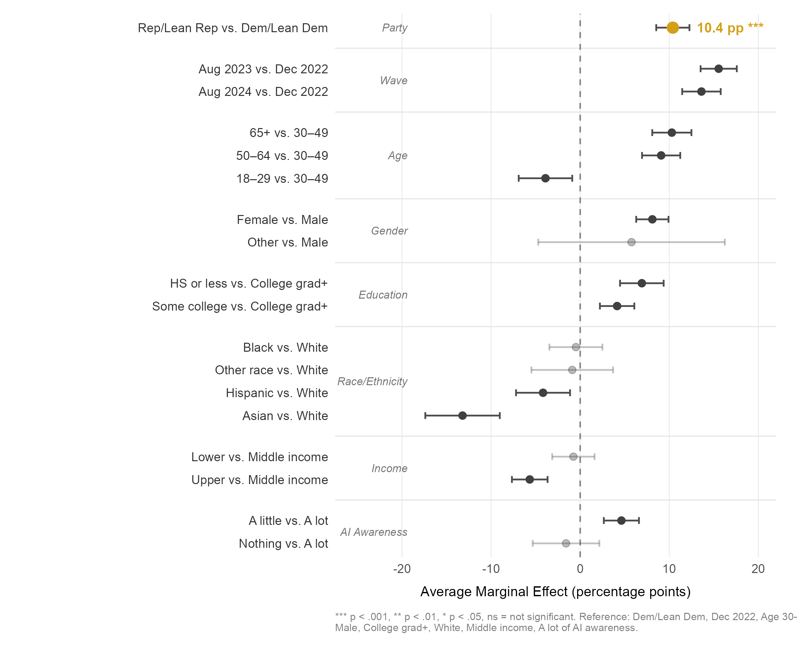

**The Politicization of Workforce Futures: Partisan Divergence, the Regulation Paradox, and Occupational Identity Threat in U.S. Artificial Intelligence Attitudes, 2022–2024**

Hosung You

Department of Learning and Performance Systems, College of Education, Pennsylvania State University

**Author Note**

Hosung You, Department of Learning and Performance Systems, College of Education, Pennsylvania State University, University Park, PA 16802, United States.

Correspondence concerning this article should be addressed to Hosung You, Department of Learning and Performance Systems, Pennsylvania State University. Email: hosung@psu.edu

## Abstract

This study investigates why the most AI-concerned partisan constituency in the United States simultaneously opposes AI regulation—a *regulation paradox* that challenges standard risk governance assumptions. Analyzing three waves of the Pew Research Center American Trends Panel (repeated cross-sectional design; December 2022, August 2023, August 2024; total *N* = 24,741), we draw on identity-protective cognition, motivated reasoning, and occupational identity threat theory to examine how partisan identity structures AI attitudes independently of knowledge, concern intensity, and demographic composition. Survey-weighted logistic regression, Blinder-Oaxaca decomposition, and wave-specific attitude batteries yield five principal findings. First, Republican identification is associated with higher AI concern more strongly than education, age, or AI familiarity (OR = 1.76, *p* < .001), though the partisan gap narrowed from 12.5 to 7.0 percentage points between 2022 and 2024. Second, partisan concerns exhibit qualitatively distinct profiles: Republicans disproportionately emphasize threats to human connection (gap = 11.3 pp) and job loss (gap = 7.9 pp), while no significant partisan gap appears for AI-generated inaccurate information—identifying a potential site of bipartisan consensus. Third, we document a regulation paradox: Republicans report higher AI concern yet are substantially less likely to support stricter AI regulation (OR = 0.49, *p* < .001), and this divergence persists at equivalent concern levels (interaction OR = 1.04, *p* = .785), indicating a structural decoupling of risk perception from policy demand along partisan lines. Fourth, Democrats score higher on AI factual knowledge (*M* = 3.89 vs. 3.69, *p* = .002), yet within-party knowledge variation does not moderate the partisan concern gap (interaction OR = 1.00, *p* = .925), contradicting the information deficit model's prediction that knowledge closes attitude gaps. Fifth, occupation-specific displacement concern varies systematically by occupation, with gaps ranging from +13.0 percentage points for teachers to −3.7 percentage points for truck drivers, and domain-level analysis identifies policing as the sole domain in which Republicans express greater AI optimism than Democrats, suggesting that domain-specific political valences structure AI attitudes more powerfully than generalized technology orientation. These findings carry direct implications for AI governance design, workforce development practice, and science communication strategy.

**Keywords:** artificial intelligence attitudes, political polarization, regulation paradox, identity-protective cognition, occupational identity threat, workforce development

\newpage

## 1. Introduction

In eight months, the share of Americans who said they were more concerned than excited about artificial intelligence jumped from 38% to 53%. That 15-percentage-point surge, captured across two waves of Pew Research Center data bracketing the public release of ChatGPT, outpaced almost any comparable shift in public technology attitudes on record (Pew Research Center, 2023). What makes the number more striking is what predicted it: not education, not age, not income, not even familiarity with AI, but partisan political identity. Republican-leaning respondents were 76% more likely than Democratic-leaning respondents to express concern (OR = 1.76, *p* < .001), and that gap held after adjusting for every conventional demographic variable in the model. The workforce that human resource development (HRD) practitioners are preparing for an AI-transformed economy does not evaluate the technology on its technical merits alone; workers filter AI through identities shaped, in part, by partisan politics.

The aggregate trend, however, obscures three puzzles that existing research cannot explain. First, Republicans report higher concern about AI yet are simultaneously less supportive of government regulation—a *regulation paradox* that violates the standard assumption linking risk perception to policy demand (Slovic, 1987). Second, Democrats score significantly higher on AI factual knowledge, yet this knowledge advantage does not close the partisan concern gap—a finding that directly falsifies the information deficit model long dominant in science communication (Nisbet & Mooney, 2007). Third, the partisan gap in AI job displacement concern is not uniform across occupations but varies systematically in a pattern consistent with occupational identity threat theory (Petriglieri, 2011), with the largest gaps appearing for occupations tied to shifting partisan coalitions and a striking reversal for truck drivers. None of these findings can be derived from conventional technology acceptance frameworks (Davis, 1989; Venkatesh et al., 2003) or from the general observation that AI concern is rising.

This study addresses these puzzles by analyzing three waves of the Pew Research Center American Trends Panel (ATP), collected in December 2022, August 2023, and August 2024 (total analytic *N* = 24,741). We integrate occupational identity threat theory (Petriglieri, 2011), loss aversion from prospect theory (Kahneman & Tversky, 1979), the information deficit model (Nisbet & Mooney, 2007; Scheufele, 2013), and institutional trust literature (Hetherington & Rudolph, 2015) into a unified framework that explains not only the *level* of partisan divergence in AI attitudes but also its *content*, its *paradoxical relationship to policy preferences*, and its *occupation-specific texture*.

The analysis makes five contributions to the literature on technology forecasting and social change. First, it provides the most comprehensive empirical documentation to date of the partisan structure of AI attitudes using nationally representative repeated cross-sectional data with survey weights. Second, it identifies and theoretically explains the regulation paradox—the first empirical demonstration that concern and policy demand decouple along partisan lines in the AI domain. Third, it falsifies the information deficit model as applied to AI attitudes, showing that factual AI knowledge does not moderate the partisan concern gap. Fourth, it provides the first direct test of occupational identity threat theory using occupation-specific AI displacement items, moving beyond the indirect inferences that have characterized prior work. Fifth, it identifies domain-level variation in AI attitudes, including a policing reversal that identifies a potential site of bipartisan AI governance consensus.

## 2. Theoretical Framework

### 2.1 AI Attitudes in the Post-ChatGPT Era

Public attitudes toward AI underwent a sharp transformation after the release of ChatGPT in November 2022. Before this inflection point, AI attitudes were characterized by moderate ambivalence—a mixture of cautious optimism and uncertainty with relatively few expressing strong concern or enthusiasm (Zhang & Dafoe, 2019; Cave & Dihal, 2019). International surveys documented similar patterns of measured ambivalence across developed democracies (Neudert et al., 2020; Eurobarometer, 2017). Fast and Horvitz (2017) traced thirty years of media coverage and found that optimistic and pessimistic AI narratives had remained roughly balanced until the mid-2010s, when concern narratives began to overtake optimistic ones.

The post-ChatGPT period shattered this equilibrium. The Pew Research Center documented a 15-percentage-point surge in concern between late 2022 and mid-2023, accompanied by a 5-percentage-point decline in excitement (Pew Research Center, 2023). The asymmetry is theoretically significant: concern surged three times faster than excitement declined. By August 2024, concern had stabilized near its peak at 50.9%, pointing to a durable reorientation rather than a transient media-driven reaction (Pew Research Center, 2024). Kieslich et al. (2022) demonstrated that individuals can simultaneously hold positive and negative evaluations of AI depending on the domain of application, suggesting that attitudes are multi-dimensional rather than bipolar.

Critically, aggregate trends obscure systematic variation along political lines. Schiff et al. (2024) found that partisan identity structures AI policy preferences, and Pew's own cross-tabulations consistently showed Republican-leaning respondents reporting higher concern. Yet no study has systematically theorized *why* political identity predicts AI attitudes or tracked the temporal dynamics of partisan AI attitudes across multiple time points using rigorous methods.

### 2.2 Occupational Identity Threat

Occupational identity—the web of attributes, beliefs, values, and experiences that individuals use to define themselves in their professional roles—represents a central component of adult identity in industrialized societies (Ashforth & Kreiner, 1999; Pratt et al., 2006). Petriglieri (2011) defined identity threat as an experience appraised as indicating potential harm to the value, meanings, or enactment of an identity. Her framework identifies three dimensions of threat: threats to an identity's *value* (devaluation), *meanings* (redefinition), and *enactment* (inability to perform constitutive activities). AI strikes at all three simultaneously—it automates activities through which workers express their identities, devalues expertise by demonstrating algorithmic alternatives, and alters the meanings of professional roles (Parker & Grote, 2022).

We extend this framework through the concept of *vicarious occupational identity threat*. Social identity theory (Tajfel & Turner, 1979) established that self-concept derives not only from personal attributes but from group memberships. In the contemporary United States, political parties function as meta-identities that absorb occupational, regional, and cultural affiliations (Mason, 2018; Iyengar et al., 2019). The realignment of working-class voters toward the Republican Party (Sides et al., 2022) means that Republican identifiers increasingly define themselves through blue-collar occupational communities whose foundations AI threatens. The theoretical mechanism we propose is straightforward: AI displacement concern among Republicans may reflect not only personal job insecurity but threat experienced on behalf of occupational in-groups whose welfare is bound up with partisan identity. If this mechanism operates, it would explain why party identification predicts AI concern independently of personal AI exposure. We test the observable implications of this proposal—occupation-specific partisan gaps that track identity congruence rather than objective displacement risk—while acknowledging that direct measurement of vicarious identification would require purpose-built instruments pairing displacement items with occupational identification scales.

### 2.3 Loss Aversion and Asymmetric Risk Perception

Prospect theory predicts that losses loom larger than equivalent gains (Kahneman & Tversky, 1979; Tversky & Kahneman, 1991). Applied to AI attitudes, this implies that potential job loss should generate stronger attitudinal responses than potential productivity gains. The empirical pattern is consistent: the surge in AI concern following ChatGPT's release (38.2% to 53.2%) was approximately three times larger than the decline in excitement (15.5% to 10.3%). Loewenstein et al. (2001) extended prospect theory to the "risk as feelings" hypothesis, arguing that risk evaluations are driven by affective responses that operate independently of cognitive assessment. In the AI domain, this means that the *feeling* of occupational threat may drive concern even among individuals who cognitively acknowledge AI's potential benefits.

The loss aversion framework also explains why partisan convergence occurs asymmetrically. If both parties are moving toward concern—Democrats initially through equity and bias frames, Republicans through displacement and autonomy frames—the convergent endpoint is elevated concern, not elevated enthusiasm. The gain side of AI (productivity, innovation) lacks the affective urgency of the loss side (displacement, autonomy erosion), consistent with the asymmetric value function of prospect theory.

### 2.4 The Information Deficit Model and Its Limits

The information deficit model—which has guided science communication practice for decades—posits that public skepticism toward science and technology reflects insufficient understanding, and that providing accurate information will close attitude gaps (Nisbet & Mooney, 2007). Applied to AI, this model predicts that individuals with greater AI knowledge should hold attitudes more closely aligned with expert assessments, and that partisan differences in AI attitudes should diminish with increasing knowledge.

However, research on climate change (Kahan et al., 2012; McCright & Dunlap, 2011), vaccination (Hornsey et al., 2018), and nuclear energy (Ho et al., 2019) has repeatedly falsified this prediction. Kahan (2015) demonstrated that science curiosity *increases* rather than decreases attitude differentiation by ideology, a phenomenon he attributed to identity-protective cognition—the tendency to process information in ways that protect one's group identity. Hart and Nisbet (2012) showed similar patterns in climate communication: exposure to identical scientific information produced divergent responses depending on recipients' political orientations.

The AI domain presents a particularly stringent test of the deficit model because AI knowledge is measurable through factual assessment (unlike values-laden domains such as climate policy). If politically knowledgeable individuals in each party still diverge in their AI attitudes, the deficit model fails in its strongest possible application.

### 2.5 The Regulation Paradox: Concern Without Policy Demand

Classic risk perception frameworks assume a positive relationship between perceived risk and demand for risk regulation (Slovic, 1987; Fischhoff et al., 1978). Individuals who perceive greater risk from a technology should, *ceteris paribus*, support stricter regulatory oversight. This assumption underlies the policy architecture of technology governance: identify public concerns, then calibrate regulation to address them.

The regulation paradox we document in this study—Republicans expressing higher AI concern alongside lower support for AI regulation—violates this assumption. The paradox implicates at least two independent political dispositions: risk perception (Republicans higher for AI) and institutional trust in government-led regulation (Republicans lower). Hetherington and Rudolph (2015) documented a deep and widening partisan divide in government trust that structures policy preferences across domains. Sunstein (2019) noted that AI governance faces the distinctive challenge of requiring institutional coordination in an era of institutional distrust.

We theorize that the regulation paradox reflects what we term *orphaned concern*—risk perception that lacks a politically viable institutional outlet. Republican concern about AI is genuine but cannot be channeled into regulatory demand without violating anti-government ideological commitments. This mechanism is best understood through the lens of motivated reasoning (Taber & Lodge, 2006) and partisan cue-taking (Zaller, 1992; Druckman et al., 2013). Taber and Lodge (2006) demonstrated that individuals evaluate policy proposals through a partisan filter that operates prior to and independently of substantive evaluation—a process they termed "motivated skepticism." Applied to AI, this means that Republican respondents may evaluate AI risk on its substantive merits (producing high concern) while simultaneously evaluating regulation through a partisan filter (producing opposition), with the two evaluations operating in parallel rather than sequentially. Druckman et al. (2013) showed that elite partisan polarization on an issue causes mass opinion to follow elite cues even when those cues contradict individuals' own substantive assessments—a mechanism that may explain why Republican concern about AI coexists with opposition to the regulatory responses endorsed by Democratic political elites.

This creates a distinctive policy challenge: the most concerned constituency is also the constituency least amenable to the standard policy response. The parallel to climate attitudes is instructive: McCright and Dunlap (2011) documented analogous decoupling of risk perception from policy demand among conservative populations regarding environmental risk.

### 2.6 Domain-Specific Variation and the Policing Reversal

AI deployment spans diverse institutional domains, each carrying distinct political valences. Healthcare, education, criminal justice, and privacy each activate different coalitions of support and opposition depending on the alignment between AI's role in that domain and partisan policy preferences (Araujo et al., 2020; Grzymek & Puntschuh, 2019). We hypothesize that domain-level variation in AI attitudes will reflect these political valences, with Republicans expressing greater pessimism in domains where AI threatens traditional institutional arrangements and greater optimism where AI reinforces preferred policy goals.

The policing domain represents a theoretically crucial test case. Republican coalitions have historically supported law enforcement expansion and technological enhancement of policing capacity (Enns, 2016), while Democratic coalitions have grown increasingly skeptical of surveillance technologies and algorithmic decision-making in criminal justice (Brayne, 2017). If AI for policing is the sole domain in which Republicans are more optimistic, this reversal would confirm that AI attitudes are structured by domain-specific political valences rather than by a generalized orientation toward technology.

## 3. Hypotheses

Based on the theoretical framework, we test five hypotheses that collectively examine partisan identity as a filter that structures AI risk perception, policy preferences, and domain-specific evaluations:

*H1 (Partisan Dominance):* Republican/lean-Republican identification will be associated with higher AI concern after controlling for education, age, income, and AI awareness, and this partisan gap will narrow over time as both parties converge toward elevated concern—reflecting attitudinal (coefficient) change rather than compositional (demographic) shifts in the population.

*H2 (Regulation Paradox):* Among equally concerned individuals, Republicans will be less likely to support stricter AI regulation than Democrats, reflecting the structural decoupling of risk perception from policy demand along partisan lines predicted by identity-protective cognition and institutional trust asymmetry.

*H3 (Information Deficit Falsification):* Within-party variation in AI factual knowledge will not moderate the partisan gap in AI concern, contradicting the information deficit model's prediction that knowledge closes attitude gaps and consistent with identity-protective cognition (Kahan et al., 2012).

*H4 (Concern Content Differentiation):* Republican and Democratic AI concerns will exhibit qualitatively distinct profiles, with Republicans disproportionately emphasizing threats to autonomy, human connection, and occupational displacement—themes aligned with communitarian and identity-protective values—rather than showing uniformly higher concern across all items.

*H5 (Domain and Occupation Specificity):* The partisan gap in AI attitudes will vary systematically by occupation and life domain, with larger gaps in domains where AI deployment intersects with politically salient institutional arrangements and reversals in domains aligned with conservative institutional preferences (e.g., law enforcement).

## 4. Methods

### 4.1 Data Source and Sample

Data come from three waves of the Pew Research Center American Trends Panel (ATP), a nationally representative online panel of U.S. adults recruited through address-based sampling (ABS). Wave 119 (W119) was fielded December 12–18, 2022 (*N* = 11,004); Wave 132 (W132) was fielded July 17–August 13, 2023 (*N* = 11,201); and Wave 152 (W152) was fielded July 15–August 4, 2024 (*N* = 5,410). All waves included survey weights calibrated to the U.S. adult population on gender, age, education, race/ethnicity, Hispanic origin, region, metropolitan status, volunteerism, voter registration, and partisanship.

The analytic sample was restricted to respondents who identified as or leaned toward one of the two major parties (Democrat/lean Democratic and Republican/lean Republican), following Pew's standard party identification coding. After listwise deletion of respondents with missing values on key variables, the total analytic sample was *N* = 24,741 across three waves.

W132 and W152 employed split-sample (split-form) designs for selected item batteries: in W132, domain help/hurt items were split across two forms (items a–d on Form 1, items e–h on Form 2); in W152, the 10 occupation-specific job displacement items were split across two forms (items a–e on Form 1, items f–j on Form 2). All analyses respect these design constraints by analyzing items within their assigned form.

### 4.2 Measures

**Dependent variables.** The primary dependent variable across all three waves was *AI excitement versus concern* (CNCEXC), measured as a three-category item: "more excited than concerned," "equally excited and concerned," or "more concerned than excited." For regression analyses, this was dichotomized into concerned (1) versus not concerned (0), following Pew's coding convention.

Wave-specific dependent variables included: (a) *AI concern content* (AICONCERN; W152), a battery of seven items assessing concern about specific AI risks (bias in decisions, impersonation, personal information misuse, inaccurate information, insufficient understanding, reducing human connection, and job loss), each coded as a binary indicator of concern; (b) *AI regulation preference* (AIREG; W152), dichotomized into pro-regulation (government not going far enough) versus status quo/anti-regulation; (c) *occupation-specific job displacement* (AIJOBIMPCT; W152), 10 items asking whether AI will lead to fewer jobs in specific occupations, coded as binary (fewer jobs = 1); (d) *domain help/hurt assessment* (AIHLPHRT; W132), eight items asking whether AI will mostly help, mostly hurt, or make no difference in specific life domains; (e) *AI knowledge* (AIKNOW; W119), a seven-item factual knowledge index scored as the sum of correct responses (range 0–7).

**Independent variables.** The primary independent variable was *party identification* (PARTY), coded as Democrat/lean Democratic versus Republican/lean Republican. Control variables included age (four categories: 18–29, 30–49, 50–64, 65+), gender (man, woman, other), education (college graduate+, some college, high school graduate or less), race/ethnicity (White non-Hispanic, Black non-Hispanic, Hispanic, Asian non-Hispanic, other non-Hispanic), income tier (lower, middle, upper), and AI awareness (heard a lot, a little, or nothing at all). W119 additionally included *dispositional risk tolerance* (DESRISK), a validated scale measuring general comfort with technological change.

### 4.3 Analytic Strategy

All analyses employed survey weights using the `survey` package in R (Lumley, 2010). Five analytic approaches were applied:

*Pooled weighting strategy.* Each wave included calibrated survey weights (WEIGHT_W119, WEIGHT_W132, WEIGHT_W152). For pooled cross-wave analyses, we constructed a combined weight by dividing each wave-specific weight by the number of waves, ensuring that each wave contributed equally to pooled estimates regardless of sample size differences. This approach follows standard practice for pooling repeated cross-sections with wave-specific weights (Lumley, 2010). Wave-specific analyses used the wave's own calibrated weights without modification.

*Wave 152 subsample documentation.* W152 (*N* = 5,410) was administered to a subsample of the full ATP panel, reflecting Pew's standard practice of rotating question modules across waves to manage respondent burden. The WEIGHT_W152 variable is calibrated to the U.S. adult population accounting for subsample selection, nonresponse, and post-stratification benchmarks. We verified that weighted demographic distributions (party identification, age, education, gender, race/ethnicity) were comparable across all three waves (see Supplementary Table S1), confirming that the subsample did not introduce systematic demographic differences that would confound cross-wave trend estimates.

*Temporal dynamics and predictors (H1).* Survey-weighted binary logistic regression estimated the association between party identification and AI concern, adjusting for demographics and AI awareness. Wave-by-party interaction terms tested temporal moderation (H1); Wald tests assessed joint significance. Average marginal effects (AMEs) were computed via the `marginaleffects` package (Arel-Bundock et al., 2024) to express results on the probability scale. Blinder-Oaxaca decomposition for binary outcomes (Fairlie, 2005) partitioned the cross-wave difference in concern into composition and coefficient components, using Wave 1 (December 2022) coefficients as the reference group to compare later waves against the earliest baseline.

*Regulation paradox (H2).* Survey-weighted proportions by party were computed for each AICONCERN item. Rao-Scott chi-square tests (Rao & Scott, 1984) assessed bivariate associations; effect sizes were reported as Cramer's *V*. For the regulation paradox (H2), survey-weighted logistic regression modeled regulation support as a function of party, concern level (dichotomized at the median into higher/lower concern), the party-by-concern interaction, and demographic controls. The interaction term is the primary test: a null or negative interaction indicates that the partisan gap in regulation support persists regardless of concern intensity.

*Knowledge–concern interaction (H3).* The AI knowledge index was regressed on party identification to confirm the mean difference. A survey-weighted logistic regression of AI concern on party, knowledge, party-by-knowledge interaction, and controls tested H3. A second model added DESRISK to assess whether dispositional risk tolerance accounts for the partisan gap. We note that this test examines whether *within-party* knowledge variation moderates the partisan concern gap in cross-sectional data; it does not test whether *providing* information to individuals would change their attitudes, which would require experimental data.

*Concern content, occupation, and domain specificity (H4, H5).* Survey-weighted proportions by party were computed for each occupation-specific displacement item and each domain help/hurt item. Partisan gaps (Republican% − Democrat%) were computed and ranked. Rao-Scott chi-square tests with Cramer's *V* assessed significance. We report unweighted cell sizes for subgroup analyses to enable assessment of statistical power.

## 5. Results

### 5.1 Temporal Dynamics of Partisan AI Concern

Public concern about AI surged from 38.2% in December 2022 to 53.2% in August 2023, with only a modest retreat to 50.9% by August 2024 (Figure 1). Simultaneously, the proportion reporting more excitement than concern declined from 15.5% to 10.3% to 10.1%, while the ambivalent middle ("equal mix") contracted from 46.3% to 36.5% to 39.0%. Consistent with loss aversion predictions, the magnitude of the concern increase (15.0 percentage points) substantially exceeded the magnitude of the excitement decrease (5.2 percentage points).

*Figure 1.* Proportion of respondents expressing more concern than excitement about AI, by party identification and wave (December 2022–August 2024). Annotated values indicate the average marginal effect (AME) of Republican identification at each wave. The narrowing gap from 12.5 to 7.0 percentage points was statistically significant (Wald test for wave × party interaction: *p* = .021).

Supporting H1, Republican/lean-Republican identification was the strongest demographic predictor of AI concern in the pooled sample (OR = 1.76, 95% CI [1.54, 2.02], *p* < .001), exceeding the effects of education (high school or less vs. college: OR = 1.38, *p* < .001), age (65+ vs. 30–49: OR = 1.50, *p* < .001), and gender (woman vs. man: OR = 1.36, *p* < .001). The AME for Republican identification was 10.4 percentage points (95% CI [8.5, 12.3], *p* < .001), meaning that after adjusting for all demographic and awareness variables, Republicans were 10.4 points more likely to express concern than Democrats (Figure 6).

*Figure 6.* Average marginal effects (AMEs) from survey-weighted binary logistic regression predicting AI concern (pooled sample). Points represent AMEs; horizontal lines represent 95% confidence intervals. Republican party identification shows the largest single-predictor effect at 10.4 percentage points.

Also consistent with H1, the partisan gap narrowed significantly across waves. AMEs by wave showed the Republican–Democratic gap declining from 12.5 percentage points (95% CI [9.6, 15.4]) in December 2022 to 10.0 percentage points (95% CI [7.0, 13.1]) in August 2023 to 7.0 percentage points (95% CI [3.7, 10.2]) in August 2024. The Wald test for the joint significance of wave-by-party interaction terms confirmed that this narrowing was statistically significant (*p* = .021). Neither the wave-by-education (*p* = .563) nor wave-by-age (*p* = .883) interaction terms were significant, indicating that the convergence pattern was specific to partisanship rather than reflecting broader demographic trends.

### 5.2 Multivariate Predictors and Blinder-Oaxaca Decomposition

Table 1 presents the full logistic regression model. Beyond party identification, significant predictors of AI concern included older age (50–64: OR = 1.40, *p* < .001; 65+: OR = 1.50, *p* < .001), female gender (OR = 1.36, *p* < .001), lower education (high school or less: OR = 1.38, *p* < .001; some college: OR = 1.17, *p* = .024), and lower AI familiarity (heard "a little": OR = 1.21, *p* = .020). Upper-income respondents were less likely to express concern (OR = 0.84, *p* = .016). Two race/ethnicity findings merit attention: Hispanic respondents (OR = 0.76, 95% CI [0.60, 0.95], *p* = .016) and Asian non-Hispanic respondents (OR = 0.64, 95% CI [0.44, 0.94], *p* = .022) were significantly less likely to express AI concern compared to White non-Hispanic respondents, after controlling for education, income, and AI awareness. These patterns may reflect differential exposure to AI-optimistic narratives in immigrant-origin communities where technology is associated with economic mobility, or cultural variation in technology orientation that is not captured by our demographic controls. We note, however, that the Asian non-Hispanic estimate is based on a relatively small subgroup and should be interpreted with caution.

**Table 1**

*Survey-Weighted Binary Logistic Regression Predicting AI Concern (Pooled Sample, N = 9,763)*

| Predictor | OR | 95% CI | *p* |
|---|---|---|---|
| Party: Rep/Lean Rep (ref: Dem) | 1.76 | [1.54, 2.02] | < .001 |
| Age: 50–64 (ref: 30–49) | 1.40 | [1.20, 1.64] | < .001 |
| Age: 65+ | 1.50 | [1.27, 1.76] | < .001 |
| Age: 18–29 | 0.92 | [0.73, 1.17] | .500 |
| Gender: Woman (ref: Man) | 1.36 | [1.19, 1.55] | < .001 |
| Education: HS or less (ref: College+) | 1.38 | [1.15, 1.64] | < .001 |
| Education: Some college | 1.17 | [1.02, 1.35] | .024 |
| Race: Hispanic (ref: White) | 0.76 | [0.60, 0.95] | .016 |
| Race: Asian non-Hispanic | 0.64 | [0.44, 0.94] | .022 |
| Income: Upper (ref: Middle) | 0.84 | [0.72, 0.97] | .016 |
| AI heard: A little (ref: A lot) | 1.21 | [1.03, 1.42] | .020 |
| AI heard: Nothing at all | 1.29 | [1.00, 1.67] | .049 |
| AI knowledge (continuous) | 0.98 | [0.95, 1.02] | .381 |

*Note.* Model includes survey weights. Logistic regression with quasibinomial family. OR = odds ratio; CI = confidence interval. The analytic *N* = 9,763 reflects the pooled sample after listwise deletion of respondents with missing values on any covariate included in the model. The AI knowledge index (AIKNOW) was available only in W119, but the pooled model excludes it; the reduced *N* reflects missing values on other covariates (income tier, AI awareness) across all three waves.

Blinder-Oaxaca decomposition (Table 2) indicated that the cross-wave difference in AI concern was associated almost entirely with coefficient components (106.1% of the gap), not with compositional demographic differences between waves (−6.1%). The raw gap between the most recent wave and the baseline was 13.3 percentage points. Within composition effects, the largest single component was AI awareness (−27.5%), reflecting that greater familiarity with AI spread across the population between waves, which partially offset rising concern. Party composition contributed only 4.8% of the gap. The dominance of coefficient effects indicates genuine attitudinal change rather than a sampling artifact.

**Table 2**

*Blinder-Oaxaca Decomposition of Cross-Wave Change in AI Concern*

| Component | Value | % of Gap |
|---|---|---|
| Raw gap (Wave 3 − Wave 1) | 0.134 | 100.0% |
| Composition effect (total) | −0.008 | −6.1% |
| Coefficient effect (total) | 0.142 | 106.1% |
| Composition: Age | −0.002 | −1.6% |
| Composition: Gender | −0.007 | −5.0% |
| Composition: Education | 0.002 | 1.5% |
| Composition: AI awareness | −0.037 | −27.5% |
| Composition: Party | 0.006 | 4.8% |

### 5.3 The Content of Concern

To move beyond the binary concerned/not-concerned measure, we analyzed the seven-item AICONCERN battery from W152 (*N* = 5,410). H4 predicted that partisan concerns would exhibit qualitatively distinct profiles rather than uniform intensity differences. The results provide strong support (Figure 3).

*Figure 3.* Survey-weighted percentage of respondents expressing concern about specific AI risks, by party identification (W152, *N* = 5,410). Items sorted by Republican–Democrat gap. Asterisks indicate statistically significant partisan gaps (\**p* < .05; \*\*\**p* < .001).

Table 3 presents survey-weighted concern percentages by party for each item. The partisan gaps were not uniform. The largest gap appeared for *reducing human connection* (Republican 63.4% vs. Democrat 52.0%, gap = 11.3 percentage points, $\chi^2$ = 64.18, *p* < .001, Cramer's *V* = 0.111)—a concern reflecting the existential and relational dimensions of AI threat that resonate with conservative communitarian values. The second-largest gap was for *job loss* (Republican 60.1% vs. Democrat 52.1%, gap = 7.9 points, $\chi^2$ = 29.33, *p* < .001, *V* = 0.075), consistent with the occupational identity threat mechanism. *Bias in AI decisions* also showed a significant gap (Republican 59.1% vs. Democrat 52.2%, gap = 6.9 points, $\chi^2$ = 25.1, *p* < .001, *V* = 0.070), though notably, concern about bias was not a Democratic-dominant issue—both parties expressed substantial concern, but Republicans were *more* concerned.

Critically, two items showed no significant partisan gap: *inaccurate information* (Republican 66.7% vs. Democrat 68.1%, gap = −1.3 points, *p* = .411) and *insufficient understanding of AI* (Republican 60.2% vs. Democrat 57.4%, gap = 2.8 points, *p* = .305). These null results are theoretically informative: they identify the domains in which partisan identity does *not* structure AI attitudes, providing boundary conditions for the politicization thesis.

**Table 3**

*AI Concern Content Profile by Party (W152, N = 5,410)*

| Concern Item | Rep % | Dem % | Gap (pp) | $\chi^2$ | *V* | Sig. |
|---|---|---|---|---|---|---|
| Reducing human connection | 63.4 | 52.0 | 11.3 | 64.18 | 0.111 | *** |
| Job loss | 60.1 | 52.1 | 7.9 | 29.33 | 0.075 | *** |
| Bias in AI decisions | 59.1 | 52.2 | 6.9 | 25.10 | 0.070 | *** |
| Personal info misuse | 74.7 | 68.0 | 6.7 | 20.40 | 0.063 | *** |
| AI impersonating people | 80.8 | 76.6 | 4.2 | 3.85 | 0.027 | * |
| Not understanding AI | 60.2 | 57.4 | 2.8 | 1.05 | 0.014 | — |
| Inaccurate information | 66.7 | 68.1 | −1.3 | 0.68 | 0.011 | — |

*Note.* Percentages are survey-weighted. Gap = Republican% − Democrat%. Rao-Scott chi-square tests. Effect sizes (*V* = 0.07–0.11) represent small-to-moderate effects, consistent with population-level attitude survey research where even politically powerful variables rarely exceed *V* = 0.15 on any single item. \**p* < .05; \*\*\**p* < .001.

The concern profile confirms H4. Republicans and Democrats do not simply differ in the intensity of their AI worry; they worry about different things. Republicans are more troubled by AI's potential to erode human connection and displace jobs—themes rooted in autonomy, community, and occupational identity. That Republicans also express *higher* concern about bias in AI decisions (59.1% vs. 52.2%) is unexpected, since algorithmic bias is conventionally framed as a progressive issue linked to equity and discrimination (Floridi et al., 2018). The most plausible reading is that the two coalitions mean different things by "bias." For Democrats, the word likely invokes disparate impact on marginalized groups; for Republicans, it may signal suspicion that AI systems encode liberal cultural assumptions. Motivated reasoning theory (Kunda, 1990) predicts exactly this kind of semantic divergence: partisans can converge on a label while diverging on its referent. Future research should disaggregate bias concern with items that separate fairness-oriented from ideological-distrust framings. Meanwhile, the absence of a partisan gap on inaccurate information (*p* = .411) marks that domain as a rare site of bipartisan agreement—and a plausible starting point for cross-partisan AI governance.

### 5.4 The Regulation Paradox

The relationship between AI concern and regulation preferences produced what may be the study's most consequential result. Despite expressing higher concern, Republicans were substantially less likely to support stricter AI regulation. Table 4 presents the survey-weighted logistic regression of regulation support (government should go further in regulating AI = 1).

**Table 4**

*Logistic Regression Predicting Support for Stricter AI Regulation (W152, N = 5,166)*

| Predictor | OR | 95% CI | *p* |
|---|---|---|---|
| Party: Rep/Lean Rep | 0.49 | [0.40, 0.61] | < .001 |
| Concern: Higher (ref: Lower) | 1.87 | [1.53, 2.29] | < .001 |
| Party × Concern interaction | 1.04 | [0.78, 1.39] | .785 |
| Age: 50–64 | 1.42 | [1.12, 1.81] | .004 |
| Age: 65+ | 1.36 | [1.08, 1.73] | .010 |
| Gender: Female | 0.79 | [0.68, 0.92] | .002 |
| Education: HS or less | 0.64 | [0.53, 0.78] | < .001 |
| Race: Black non-Hispanic | 0.43 | [0.34, 0.55] | < .001 |
| AI heard: Nothing at all | 0.29 | [0.19, 0.44] | < .001 |

*Note.* OR = odds ratio. Survey-weighted logistic regression with quasibinomial family.

The results provide unambiguous support for H2. Higher concern predicted greater support for regulation (OR = 1.87, *p* < .001), as expected from standard risk perception theory. However, Republican identification predicted *lower* regulation support even after controlling for concern level (OR = 0.49, *p* < .001). The party-by-concern interaction was null (OR = 1.04, 95% CI [0.78, 1.39], *p* = .785), meaning that the partisan gap in regulation support was statistically invariant across concern levels. In observed proportions: among those with *lower* concern, 56.7% of Democrats supported stricter regulation compared to 44.3% of Republicans; among those with *higher* concern, 71.6% of Democrats supported stricter regulation compared to 62.0% of Republicans. The approximately 10-percentage-point Republican deficit persisted regardless of concern intensity (Figure 2).

*Figure 2.* The Regulation Paradox. Left panel: Observed proportions supporting stricter AI regulation by party and concern level. Right panel: The persistent ~10 percentage-point partisan gap at all concern levels. The null interaction (OR = 1.04, *p* = .785) confirms structural decoupling of risk perception from policy demand.

This is the regulation paradox: the more concerned party demands less regulatory action. The null interaction is the critical finding. It rules out the possibility that highly concerned Republicans have simply not yet translated their concern into policy demand. The decoupling of concern from regulation preference is structural, not transitional—exactly the pattern predicted by the institutional trust asymmetry theorized in Section 2.5.

### 5.5 Knowledge and Concern—Testing the Information Deficit Model

W119 included a seven-item AI knowledge assessment, enabling a direct test of the information deficit model. Democrats scored significantly higher on the AI knowledge index (*M* = 3.89, *SE* = 0.05) than Republicans (*M* = 3.69, *SE* = 0.05), *t* = −3.05, *p* = .002. A larger proportion of Democrats (51.8%) than Republicans (45.9%) scored at or above the "high knowledge" threshold of 5 out of 7 correct. This finding alone is noteworthy: the party expressing lower concern (Democrats) possesses *more* factual knowledge about AI, directly contradicting the deficit model's prediction that knowledge reduces concern.

The critical test is whether AI knowledge moderates the partisan concern gap. Table 5 presents the knowledge-by-party interaction model. The interaction term was null (OR = 1.003, 95% CI [0.944, 1.065], *p* = .925), indicating that the partisan gap in AI concern did not vary as a function of AI knowledge. High-knowledge Republicans were just as much more concerned than high-knowledge Democrats as low-knowledge Republicans were relative to low-knowledge Democrats. The information deficit model is unambiguously falsified: providing more AI knowledge to the public will not close the partisan concern gap.

A supplementary analysis, restricted to W119 respondents who completed the dispositional risk tolerance scale (DESRISK; *n* = 3,264), tested whether generalized comfort with technological change accounts for the partisan gap. In the base model without DESRISK, the party OR was 1.77 (95% CI [1.44, 2.18], *p* < .001); adding DESRISK attenuated the party OR to 1.74 (95% CI [1.41, 2.15], *p* < .001)—a reduction of only 1.3%. This indicates that the partisan difference in AI concern operates independently of generalized risk orientation and is specifically political rather than dispositional.

### 5.6 Occupation-Specific Displacement Threat

W152 asked respondents whether AI would lead to *fewer jobs* in 10 specific occupations. H5 predicted that the partisan gap in displacement concern would vary by occupation in a theoretically structured pattern. The results provide strong support (Figure 4; Table 6).

*Figure 4.* Occupation-specific AI job displacement concern by party identification (W152). Dumbbell chart showing the percentage of respondents expecting AI to lead to fewer jobs in each occupation. Occupations sorted by Republican–Democrat gap. The truck driver reversal (Democrats more concerned) is highlighted.

**Table 6**

*Occupation-Specific AI Job Displacement Concern by Party (W152)*

| Occupation | Rep % | Dem % | Gap (pp) | *V* | Sig. |
|---|---|---|---|---|---|
| Teachers | 49.7 | 36.7 | +13.0 | 0.125 | *** |
| Medical doctors | 33.2 | 22.3 | +10.9 | 0.123 | *** |
| Factory workers | 72.1 | 62.9 | +9.2 | 0.100 | *** |
| Mental health therapists | 33.3 | 25.3 | +8.0 | 0.079 | *** |
| Cashiers | 77.9 | 70.1 | +7.8 | 0.082 | *** |
| Lawyers | 26.8 | 19.4 | +7.4 | 0.074 | *** |
| Software engineers | 51.8 | 44.8 | +7.1 | 0.063 | ** |
| Journalists | 62.4 | 56.9 | +5.5 | 0.040 | * |
| Musicians | 47.8 | 43.8 | +4.0 | 0.040 | * |
| Truck drivers | 30.2 | 33.9 | −3.7 | 0.040 | * |

*Note.* Items administered in split-sample design (a–e on Form 1, f–j on Form 2). Gap = Republican% − Democrat%.

The variation across occupations is striking. Teachers produced the largest gap (+13.0 points, *V* = 0.125), followed by medical doctors (+10.9 points, *V* = 0.123) and factory workers (+9.2 points, *V* = 0.100). At the opposite extreme, truck drivers produced a *reversed* gap (−3.7 points, *p* = .041): Democrats were *more* likely than Republicans to expect AI-induced job loss for truck drivers. This reversal is theoretically significant. Truck driving is a stereotypically Republican-identified occupation, yet Republicans are less concerned about AI displacing truck drivers—perhaps because autonomous driving technology has been discussed in public discourse for over a decade, normalizing the threat, or because truck driving as an occupation is perceived as resistant to full automation.

The pattern is not reducible to a simple blue-collar/white-collar distinction. Teachers—white-collar, historically Democratic-leaning—produced the largest gap, while factory workers—blue-collar, Republican-leaning—produced a smaller gap than medical doctors. This suggests that the partisan structure of occupational displacement concern reflects contemporary political discourse about AI (where teaching and healthcare have become prominent battlegrounds) rather than traditional occupational classifications.

### 5.7 Domain-Specific Help/Hurt Profiles

W132 assessed whether respondents thought AI would mostly help, mostly hurt, or make no difference in eight specific life domains. Table 7 presents the results.

**Table 7**

*Domain-Specific AI Assessment: Percentage Saying "Mostly Help" by Party (W132)*

| Domain | Rep % Help | Dem % Help | Gap (pp) | Rep % Hurt | Dem % Hurt | Hurt Gap | *V* | Sig. |
|---|---|---|---|---|---|---|---|---|
| Health care | 31.9 | 36.9 | −5.0 | 23.0 | 15.3 | +7.7 | 0.099 | *** |
| Vehicle safety | 35.2 | 41.1 | −5.9 | 22.2 | 15.5 | +6.7 | 0.090 | *** |
| Doctor quality | 35.5 | 40.2 | −4.7 | 23.3 | 16.9 | +6.4 | 0.080 | *** |
| Privacy | 8.3 | 11.8 | −3.5 | 58.0 | 50.2 | +7.8 | 0.060 | *** |
| Customer service | 27.2 | 30.8 | −3.6 | 38.6 | 30.9 | +7.7 | 0.051 | *** |
| Product search | 48.5 | 51.9 | −3.4 | 16.6 | 13.6 | +3.0 | 0.044 | — |
| Accurate information | 31.7 | 35.4 | −3.7 | 29.6 | 25.1 | +4.5 | 0.033 | * |
| **Policing** | **26.4** | **24.3** | **+2.1** | 26.1 | 26.1 | 0.0 | 0.059 | — |

*Note.* Percentages are survey-weighted. Gap = Republican% − Democrat%. Negative help-gap indicates Democrats more optimistic. Policing is highlighted as the sole reversal.

Republicans were more pessimistic (lower %help, higher %hurt) than Democrats in seven of eight domains. The single exception was policing, where Republicans were 2.1 percentage points *more* likely to say AI would mostly help police maintain public safety—the only domain-level reversal in the dataset (Figure 5). The policing reversal was not statistically significant at the bivariate level (*p* = .473) and should be treated as an exploratory pattern rather than confirmatory evidence for H5. Nevertheless, the directional finding is noteworthy: in every other domain, the Republican coefficient was negative. This suggestive pattern is consistent with the theoretical prediction in Section 2.6 that Republican support for law enforcement may create a domain-specific context in which AI deployment is perceived as augmenting rather than threatening a valued institution, though replication with larger samples is needed.

*Figure 5.* Domain-specific AI help/hurt assessment by party identification (W132). Butterfly chart showing the percentage of respondents saying AI will "mostly help" (left) or "mostly hurt" (right) in each life domain. Policing is the sole domain where Republicans express greater optimism than Democrats.

The largest partisan gaps in the "mostly hurt" direction appeared in privacy (Republican 58.0% vs. Democrat 50.2%, gap = 7.8 points), customer service (7.7 points), and health care (7.7 points). All three involve AI replacing or mediating human interactions where trust, personal judgment, and relational quality matter—precisely the terrain where Republican concern was highest in the concern content analysis (Section 5.3).

Supplementary analysis of trust and control measures from W152 reinforced these patterns. Republicans were significantly less likely to say they would eventually trust AI to act in the public's interest (11.5% "yes" vs. Democrats 17.0%, $\chi^2$ = 60.64, *p* < .001, *V* = 0.108) and reported lower perceived control over AI in their lives (19.8% "none" vs. Democrats 14.6%, $\chi^2$ = 35.60, *p* < .001, *V* = 0.083).

## 6. Discussion

What is striking about these five findings is how consistently they cut against received wisdom. The group most worried about AI does not want the government to address it. Greater factual knowledge does not narrow the partisan gap. The party least associated with equity discourse expresses *higher* concern about algorithmic bias. A prototypically Republican occupation produces a reversed gap in displacement concern, while a Democratic-leaning profession produces the largest one. And a population that grew markedly more AI-literate between 2022 and 2024 became *more* concerned, not less. Each of these results violates a specific theoretical expectation: risk perception should predict policy demand (Slovic, 1987); knowledge should close attitude gaps (Nisbet & Mooney, 2007); bias concern should track equity salience; occupational threat should map onto partisan composition; familiarity should reduce anxiety. None of them do.

The coherent picture that emerges is not one of partisan identity amplifying technology anxiety in a uniform way. Rather, partisanship operates as a *filter* that restructures what people fear, which institutions they trust to respond, and which occupations they perceive as threatened. These patterns hold after controlling for AI knowledge, persist at equivalent concern levels, and vary predictably across occupations and life domains, all in ways that identity-protective cognition (Kahan et al., 2012) and motivated reasoning (Taber & Lodge, 2006) would anticipate but that conventional technology acceptance frameworks cannot accommodate.

### 6.1 The Regulation Paradox: Partisan Identity as a Policy Filter

The regulation paradox—Republicans expressing higher AI concern alongside lower support for AI regulation—is the study's central theoretical contribution. Standard risk governance frameworks assume a positive relationship between perceived risk and regulatory demand (Slovic, 1987; Fischhoff et al., 1978). The null party-by-concern interaction (OR = 1.04, *p* = .785) demonstrates that this decoupling is *structural*, not a matter of Republican concern being insufficiently intense to trigger policy demand. At equivalent concern levels, Republicans were approximately 10 percentage points less likely to support stricter regulation.

Two mechanisms, operating simultaneously, account for this pattern. Institutional trust asymmetry (Hetherington & Rudolph, 2015) means that Republicans discount the very instrument—government regulation—through which concern is conventionally channeled into policy. Motivated reasoning (Taber & Lodge, 2006) means that the evaluation of AI risk and the evaluation of regulatory response proceed along parallel tracks: Republican respondents assess the technology on its substantive merits, producing genuine concern, while assessing regulation through a partisan lens, producing opposition. Druckman et al. (2013) showed that when political elites polarize on an issue, mass opinion follows elite cues even where those cues contradict individuals' own substantive assessments. Republican elites have framed government AI regulation as overreach, and the base has followed that signal on the policy question while maintaining its independent assessment of AI risk. The result is *orphaned concern*: risk perception that lacks a politically viable institutional outlet.

The climate parallel is worth noting. McCright and Dunlap (2011) documented an analogous decoupling of environmental risk perception from policy demand among conservative populations. The AI regulation paradox extends their finding beyond environmental politics, raising the possibility that concern-without-policy-demand is a recurring feature of conservative risk governance orientation in the contemporary United States. If so, any technology governance domain where risk perception crosses partisan lines will encounter the same structural obstacle.

### 6.2 Knowledge Without Convergence: The Limits of the Information Deficit Model

Within-party variation in AI factual knowledge does not moderate the partisan concern gap (interaction OR = 1.003, *p* = .925). Democrats know more about AI (*M* = 3.89 vs. 3.69, *p* = .002), yet that knowledge advantage buys them nothing in terms of attitude alignment: high-knowledge Democrats are no closer to their Republican counterparts than low-knowledge Democrats are. The information deficit model predicts exactly the opposite. Kahan et al. (2012) found a similar pattern for climate risk—higher science literacy *widened* rather than narrowed the partisan divide—and the AI case replicates their result in a domain where knowledge is measurable through factual assessment rather than value-laden interpretation.

A qualification is in order. Our cross-sectional test establishes that existing knowledge variation does not track with reduced partisan gaps; it cannot tell us whether *providing* information through a structured intervention would shift attitudes. The deficit model might survive in a weaker form if partisan media channels deliver systematically different AI information to each coalition. But the null interaction, combined with the DESRISK finding—dispositional risk tolerance attenuated the party coefficient by only 1.3%—leaves little room for non-political explanations. The gap is specifically partisan, not dispositional, and not informational. Kahan's (2015) identity-protective cognition offers the most parsimonious account: people process factual information in ways that protect, rather than challenge, their group commitments.

For practitioners, the implication is sobering. AI literacy campaigns designed to bridge partisan divides are unlikely to succeed and may backfire, equipping more knowledgeable partisans with better material for motivated reasoning. Communication strategies will need to move from deficit-filling toward shared-value framing and identity-respectful engagement.

### 6.3 Occupation and Domain Specificity: Identity Congruence, Not Generalized Pessimism

The spread in occupation-specific displacement concern—from +13.0 points for teachers to −3.7 points for truck drivers—is difficult to reconcile with a model of generalized Republican pessimism about AI. Were Republicans uniformly more anxious about job displacement, the gaps would be roughly constant across occupations. They are not. The pattern instead points to *identity-congruent threat perception*: concern tracks not objective displacement risk but the perceived alignment between AI's effects and valued institutional arrangements. Consider the 16.7-percentage-point swing between teachers and truck drivers. Both occupations face genuine automation exposure; neither is insulated from AI-driven disruption. The difference between them is not technical but political.

Teaching, a Democratic-leaning profession (Sides et al., 2022), produced the largest gap. This almost certainly reflects the broader politicization of education—Republicans' anxieties about AI in classrooms are entangled with ongoing battles over educational content, institutional control, and the character of the teacher-student relationship. Truck driving, by contrast, is stereotypically Republican-identified, yet Republicans were *less* likely than Democrats to expect AI-induced job loss here. The reversal, while directionally significant (*p* = .041), rests on a split-sample subgroup (*n* ≈ 2,610 per form) and warrants replication. Two explanations seem plausible: habituation after more than a decade of autonomous vehicle discourse, or direct industry knowledge about the practical barriers that still prevent full automation of long-haul routes.

The policing reversal in the domain help/hurt analysis supplies a crucial boundary condition. Across seven of eight life domains, Republicans were more pessimistic about AI than Democrats. Policing was the sole exception: Republicans were 2.1 points more likely to say AI would help police maintain public safety. The reversal did not reach conventional significance (*p* = .473) and must be treated as exploratory, but its directional uniqueness is telling. In no other domain did the Republican coefficient turn positive. Republican alignment with law enforcement (Enns, 2016) appears to create a domain-specific context in which AI is perceived as augmenting a valued institution rather than threatening one. For technology forecasters, the lesson is that partisan effects on AI adoption are domain-specific and predictable from existing political alignments—not reducible to a blanket orientation toward technology.

### 6.4 Temporal Patterns: Convergence Under Constraints

The narrowing of the partisan gap from 12.5 to 7.0 percentage points between 2022 and 2024, while statistically significant (*p* = .021), warrants cautious interpretation. Three considerations temper the convergence narrative. First, the gap remains substantial—7.0 percentage points is a meaningful population-level difference. Second, the convergence occurred primarily because Democratic concern rose to approach Republican levels, not because Republican concern declined; both parties converged toward elevated concern, consistent with loss aversion's prediction that threat-side responses are stickier than benefit-side responses (Kahneman & Tversky, 1979). Third, scale compression may contribute to apparent convergence: if Republican concern approaches a ceiling while Democratic concern rises from a lower base, some narrowing is arithmetically expected even without genuine attitude convergence.

The Blinder-Oaxaca decomposition indicates that the cross-wave difference in concern is associated primarily with coefficient (attitudinal) components (106.1%) rather than compositional (demographic) shifts in the sample (−6.1%). The single largest compositional factor was AI awareness (−27.5%), reflecting that as AI familiarity spread across the population, it partially offset rising concern.

The AI awareness dampening effect (−27.5%) deserves separate attention. Between 2022 and 2024, the share of Americans who reported having "heard a lot" about AI roughly doubled—a predictable consequence of the post-ChatGPT media saturation and growing direct exposure to generative AI tools. This compositional shift exerted a *countervailing* force: as more Americans became AI-aware, the population-level concern rate was pulled downward. Had awareness remained at 2022 levels, the observed surge in concern would have been considerably larger. The implication is paradoxical. Broader AI familiarity dampens concern at the compositional level, yet the attitudinal shift captured in the coefficient component swamped that dampening. Concern rose sharply in a population that was simultaneously becoming more AI-literate—an outcome the information deficit model cannot explain and that reinforces the pattern documented in Section 6.2.

We emphasize that this decomposition describes the components of the cross-wave difference in a repeated cross-sectional design; it does not establish that individual-level attitudes changed, which would require panel data.

## 7. Implications for Practice and Policy

### 7.1 AI Governance Design

The regulation paradox forces a rethinking of AI governance strategy. When the most concerned constituency is also the one least amenable to government regulation, conventional regulatory approaches will polarize debate rather than produce effective governance. Alternative pathways exist. *Industry self-regulation with transparency mandates* could address Republican concerns without triggering the anti-government resistance that formal regulation provokes. *Liability frameworks* assigning responsibility for AI harms to deploying organizations could satisfy both parties' desire for accountability without new bureaucracies. *Market-based approaches*—AI insurance requirements, consumer choice mechanisms—may resonate with conservative preferences for private-sector solutions. Each of these routes channels concern into institutional responses that do not require the state trust that Republicans withhold.

### 7.2 Workforce Development and HRD Practice

The occupation-specific variation in displacement concern has direct implications for human resource development. Training and reskilling programs cannot treat "AI anxiety" as monolithic. Workers in occupations with large partisan gaps—teaching, healthcare, manufacturing—face not only displacement risk but socially polarized discourse about that risk, which may create additional barriers to technology adoption and engagement with retraining programs.

HRD practitioners should design AI change management strategies that are *identity-conscious*—acknowledging that resistance to AI adoption may reflect threats to occupational identity rather than ignorance of AI's capabilities. Framing AI as augmenting rather than replacing professional judgment may reduce identity threat, particularly in domains like healthcare and education where professional autonomy is highly valued (Parker & Grote, 2022).

### 7.3 Science Communication

The deficit model's failure has immediate consequences for AI communication strategy. Literacy campaigns built on the assumption that facts reduce opposition will not achieve their goal and risk backfiring, since more knowledgeable partisans are better equipped for identity-protective reasoning (Kahan, 2015). A more promising approach would anchor communication in values that both coalitions already share. The bipartisan concern about AI-generated inaccurate information—the one domain where no significant partisan gap appeared—offers a concrete starting point: accuracy as a shared commitment rather than education as a corrective.

### 7.4 Technology Forecasting

As AI becomes more embedded in daily life, adoption trajectories may split along political lines. Forecasting models that treat adoption as a function of individual utility assessment (Rogers, 2003; Venkatesh et al., 2003) will need to incorporate political identity as a structural moderator. The policing reversal illustrates why: partisan effects are domain-specific and predictable from existing political alignments, which means forecasters already have the information they need to anticipate where AI deployment will face resistance and where it may find bipartisan support.

## 8. Limitations and Future Directions

Several limitations constrain the interpretation of these findings. First, the study relies on repeated cross-sectional data rather than panel data tracking the same individuals over time. The narrowing partisan gap (H1) is therefore an aggregate trend that may reflect compositional changes not fully captured by the Oaxaca decomposition, though the dominance of coefficient effects argues against this interpretation.

Second, the wave-specific analyses (Phases 3–7) are each based on a single wave and therefore cannot establish temporal trends for the wave-specific variables. Whether the regulation paradox, knowledge–concern asymmetry, or occupation-specific patterns are stable over time, growing, or diminishing cannot be assessed with these data.

Third, effect sizes for the concern content and domain-level analyses are small to moderate (Cramer's *V* ranging from 0.03 to 0.13). These are consistent with population-level survey research on attitudes, where even politically powerful variables rarely produce large effects on any single item, but they indicate that partisan identity is one of many factors shaping AI attitudes rather than the sole determinant.

Fourth, the AIJOBIMPCT items ask about expected job loss in specific occupations but do not measure respondents' personal identification with those occupations. The occupation-specific patterns are consistent with occupational identity threat theory but do not directly measure the identity threat mechanism. Future research should pair occupation-level displacement items with measures of occupational identification and identity centrality.

Fifth, all data come from U.S. samples, and the partisan dynamics documented here reflect the specific configuration of the American two-party system. Cross-national replication in multiparty democracies with different political cleavage structures would test whether AI politicization is a general feature of democratic technology governance or a product of American exceptionalism.

Future research should (a) track the regulation paradox longitudinally to assess whether it persists, deepens, or resolves as AI governance institutions develop; (b) test occupational identity threat directly using measures of occupational identification; (c) explore whether the policing reversal extends to other domains with conservative political valences (e.g., national defense, border security); and (d) investigate whether the information deficit falsification holds in international contexts with different media ecosystems and political cultures.

## 9. Conclusion

The conventional picture of public technology evaluation assumes a broadly rational sequence: people learn about a technology, assess its risks and benefits, and support governance proportional to their concern. This study shows that for AI in the contemporary United States, almost none of that sequence holds. The most concerned partisan constituency opposes the regulatory response that its own concern would seem to warrant. Factual knowledge does nothing to close the attitude gap between parties. The concept of "AI bias" appears to mean something different to each coalition, producing the paradox of Republicans expressing higher concern about a concept typically associated with progressive discourse. And the occupations that generate the widest and narrowest partisan gaps in displacement worry are sorted not by their actual exposure to automation but by their salience in ongoing political conflicts over education, labor, and institutional authority.

The regulation paradox challenges a foundational linkage in risk governance theory that has organized technology policy since Slovic (1987): the assumption that perceived risk generates demand for regulatory protection. The information deficit falsification closes a second avenue, showing that literacy campaigns cannot bridge divides whose roots are identitarian rather than informational. The occupation-specific patterns and the policing reversal confirm that AI attitudes are structured at the intersection of technological capability and political identity, not by any generalized orientation toward technology. Taken together, these findings indicate that the politicization of AI is not a superficial overlay on pre-existing attitudes but a force that will shape adoption trajectories, governance outcomes, and workforce development needs for years to come.

\newpage

## References

Acemoglu, D., & Restrepo, P. (2020). Robots and jobs: Evidence from US labor markets. *Journal of Political Economy*, *128*(6), 2188–2244. https://doi.org/10.1086/705716

Araujo, T., Helberger, N., Kruikemeier, S., & de Vreese, C. H. (2020). In AI we trust? Perceptions about automated decision-making by artificial intelligence. *AI & Society*, *35*(3), 611–623. https://doi.org/10.1007/s00146-019-00931-w

Arel-Bundock, V., Greifer, N., & Heiss, A. (2024). How to interpret statistical models using marginaleffects for R and Python. *Journal of Statistical Software*, *111*(9), 1–32. https://doi.org/10.18637/jss.v111.i09

Ashforth, B. E., & Kreiner, G. E. (1999). "How can you do it?": Dirty work and the challenge of constructing a positive identity. *Academy of Management Review*, *24*(3), 413–434. https://doi.org/10.5465/amr.1999.2202129

Autor, D. H. (2015). Why are there still so many jobs? The history and future of workplace automation. *Journal of Economic Perspectives*, *29*(3), 3–30. https://doi.org/10.1257/jep.29.3.3

Bail, C. A., Argyle, L. P., Brown, T. W., Bumpus, J. P., Chen, H., Hunzaker, M. F., Lee, J., Mann, M., Merhout, F., & Volfovsky, A. (2018). Exposure to opposing views on social media can increase political polarization. *Proceedings of the National Academy of Sciences*, *115*(37), 9216–9221. https://doi.org/10.1073/pnas.1804840115

Bolsen, T., & Druckman, J. N. (2015). Counterframing effects. *Journal of Politics*, *77*(4), 1017–1034. https://doi.org/10.1086/682984

Brayne, S. (2017). Big data surveillance: The case of policing. *American Sociological Review*, *82*(5), 977–1008. https://doi.org/10.1177/0003122417725865

Brynjolfsson, E., & McAfee, A. (2014). *The second machine age: Work, progress, and prosperity in a time of brilliant technologies*. W. W. Norton.

Bucher, E. L., Schou, P. K., & Waldkirch, M. (2020). Pacifying the algorithm—Anticipatory compliance in the face of algorithmic management in the gig economy. *Organization*, *28*(1), 44–67. https://doi.org/10.1177/1350508420961531

Cave, S., & Dihal, K. (2019). Hopes and fears for intelligent machines in fiction and reality. *Nature Machine Intelligence*, *1*(2), 74–78. https://doi.org/10.1038/s42256-019-0020-9

Conroy, S. A., & O'Leary-Kelly, A. M. (2014). Letting go and moving on: Work-related identity loss and recovery. *Academy of Management Review*, *39*(1), 67–87. https://doi.org/10.5465/amr.2011.0396

Davis, F. D. (1989). Perceived usefulness, perceived ease of use, and user acceptance of information technology. *MIS Quarterly*, *13*(3), 319–340. https://doi.org/10.2307/249008

Druckman, J. N., & Bolsen, T. (2011). Framing, motivated reasoning, and opinions about emergent technologies. *Journal of Communication*, *61*(4), 659–688. https://doi.org/10.1111/j.1460-2466.2011.01562.x

Druckman, J. N., Peterson, E., & Slothuus, R. (2013). How elite partisan polarization affects public opinion formation. *American Political Science Review*, *107*(1), 57–79. https://doi.org/10.1017/S0003055412000500

Enns, P. K. (2016). *Incarceration nation: How the United States became the most punitive democracy in the world*. Cambridge University Press.

Eurobarometer. (2017). *Special Eurobarometer 460: Attitudes towards the impact of digitisation and automation on daily life*. European Commission.

Fairlie, R. W. (2005). An extension of the Blinder-Oaxaca decomposition technique to logit and probit models. *Journal of Economic and Social Measurement*, *30*(4), 305–316. https://doi.org/10.3233/JEM-2005-0259

Fast, E., & Horvitz, E. (2017). Long-term trends in the public perception of artificial intelligence. *Proceedings of the AAAI Conference on Artificial Intelligence*, *31*(1), 963–969. https://doi.org/10.1609/aaai.v31i1.10635

Fischhoff, B., Slovic, P., Lichtenstein, S., Read, S., & Combs, B. (1978). How safe is safe enough? A psychometric study of attitudes towards technological risks and benefits. *Policy Sciences*, *9*(2), 127–152. https://doi.org/10.1007/BF00143739

Floridi, L., Cowls, J., Beltrametti, M., Chatila, R., Chazerand, P., Dignum, V., Luetge, C., Madelin, R., Pagallo, U., Rossi, F., Schafer, B., Valcke, P., & Vayena, E. (2018). AI4People—An ethical framework for a good AI society: Opportunities, risks, principles, and recommendations. *Minds and Machines*, *28*(4), 689–707. https://doi.org/10.1007/s11023-018-9482-5

Frank, M. R., Autor, D., Bessen, J. E., Brynjolfsson, E., Cebrian, M., Deming, D. J., Feldman, M., Groh, M., Lobo, J., Moro, E., Wang, D., Youn, H., & Rahwan, I. (2019). Toward understanding the impact of artificial intelligence on labor. *Proceedings of the National Academy of Sciences*, *116*(14), 6531–6539. https://doi.org/10.1073/pnas.1900949116

Frey, C. B., & Osborne, M. A. (2017). The future of employment: How susceptible are jobs to computerisation? *Technological Forecasting and Social Change*, *114*, 254–280. https://doi.org/10.1016/j.techfore.2016.08.019

Grote, G., & Hall, D. T. (2013). Reference groups, social identities, and self-concepts. In S. Treiman (Ed.), *Handbook of career studies* (pp. 99–120). Sage.

Grzymek, V., & Puntschuh, M. (2019). *What Europe knows and thinks about algorithms: Results of a representative survey*. Bertelsmann Stiftung.

Guess, A. M., Barberá, P., Munzert, S., & Yang, J. (2020). The consequences of online partisan media. *Proceedings of the National Academy of Sciences*, *118*(14), e2013464118. https://doi.org/10.1073/pnas.2013464118

Hart, P. S., & Nisbet, E. C. (2012). Boomerang effects in science communication: How motivated reasoning and identity cues amplify opinion polarization about climate mitigation policies. *Communication Research*, *39*(6), 701–723. https://doi.org/10.1177/0093650211416646

Hetherington, M. J., & Rudolph, T. J. (2015). *Why Washington won't work: Polarization, political trust, and the governing crisis*. University of Chicago Press.

Ho, S. S., Leong, A. D., Looi, J., Chen, L., Pang, N., & Tandoc, E. C. (2019). Science literacy or value predisposition? A meta-analysis of factors predicting public perceptions of benefits, risks, and acceptance of nuclear energy. *Environmental Communication*, *13*(1), 76–92. https://doi.org/10.1080/17524032.2017.1394891

Hornsey, M. J., Harris, E. A., & Fielding, K. S. (2018). The psychological roots of anti-vaccination attitudes: A 24-nation investigation. *Health Psychology*, *37*(4), 307–315. https://doi.org/10.1037/hea0000586

Huddy, L. (2001). From social to political identity: A critical examination of social identity theory. *Political Psychology*, *22*(1), 127–156. https://doi.org/10.1111/0162-895X.00230

Ibarra, H. (1999). Provisional selves: Experimenting with image and identity in professional adaptation. *Administrative Science Quarterly*, *44*(4), 764–791. https://doi.org/10.2307/2667055

Iyengar, S., Lelkes, Y., Levendusky, M., Malhotra, N., & Westwood, S. J. (2019). The origins and consequences of affective polarization in the United States. *Annual Review of Political Science*, *22*, 129–146. https://doi.org/10.1146/annurev-polisci-051117-073034

Jarrahi, M. H. (2018). Artificial intelligence and the future of work: Human-AI symbiosis in organizational decision making. *Business Horizons*, *61*(4), 577–586. https://doi.org/10.1016/j.bushor.2018.03.007

Jobin, A., Ienca, M., & Vayena, E. (2019). The global landscape of AI ethics guidelines. *Nature Machine Intelligence*, *1*(9), 389–399. https://doi.org/10.1038/s42256-019-0088-2

Kahan, D. M. (2015). Climate-science communication and the measurement problem. *Political Psychology*, *36*(S1), 1–43. https://doi.org/10.1111/pops.12244

Kunda, Z. (1990). The case for motivated reasoning. *Psychological Bulletin*, *108*(3), 480–498. https://doi.org/10.1037/0033-2909.108.3.480

Kahan, D. M., Peters, E., Wittlin, M., Slovic, P., Ouellette, L. L., Braman, D., & Mandel, G. (2012). The polarizing impact of science literacy and numeracy on perceived climate change risks. *Nature Climate Change*, *2*(10), 732–735. https://doi.org/10.1038/nclimate1547

Kahneman, D., & Tversky, A. (1979). Prospect theory: An analysis of decision under risk. *Econometrica*, *47*(2), 263–291. https://doi.org/10.2307/1914185

Kieslich, K., Keller, B., & Starke, C. (2022). Artificial intelligence ethics by design: Evaluating public perception on the importance of ethical design principles of artificial intelligence. *Big Data & Society*, *9*(1), 1–15. https://doi.org/10.1177/20539517221092956

Kreiner, G. E., Hollensbe, E. C., & Sheep, M. L. (2006). Where is the "me" among the "we"? Identity work and the search for optimal balance. *Academy of Management Journal*, *49*(5), 1031–1057. https://doi.org/10.5465/amj.2006.22798174

Loewenstein, G. F., Weber, E. U., Hsee, C. K., & Welch, N. (2001). Risk as feelings. *Psychological Bulletin*, *127*(2), 267–286. https://doi.org/10.1037/0033-2909.127.2.267

Lumley, T. (2010). *Complex surveys: A guide to analysis using R*. Wiley.

Makridakis, S. (2017). The forthcoming artificial intelligence (AI) revolution: Its impact on society and firms. *Futures*, *90*, 46–60. https://doi.org/10.1016/j.futures.2017.03.006

Mason, L. (2018). *Uncivil agreement: How politics became our identity*. University of Chicago Press.

McCright, A. M., & Dunlap, R. E. (2011). The politicization of climate change and polarization in the American public's views of global warming, 2001–2010. *Sociological Quarterly*, *52*(2), 155–194. https://doi.org/10.1111/j.1533-8525.2011.01198.x

Neudert, L.-M., Knuutila, A., & Howard, P. N. (2020). *Global attitudes towards AI, machine learning & automated decision making*. Oxford Internet Institute.

Nisbet, M. C., & Mooney, C. (2007). Framing science. *Science*, *316*(5821), 56. https://doi.org/10.1126/science.1142030

Parker, S. K., & Grote, G. (2022). Automation, algorithms, and beyond: Why work design matters more than ever in a digital world. *Applied Psychology*, *71*(4), 1171–1204. https://doi.org/10.1111/apps.12241

Petriglieri, J. L. (2011). Under threat: Responses to and the consequences of threats to individuals' identities. *Academy of Management Review*, *36*(4), 641–662. https://doi.org/10.5465/amr.2009.0091

Pew Research Center. (2023). *Growing public concern about the role of artificial intelligence in daily life*. https://www.pewresearch.org/science/2023/08/28/growing-public-concern-about-the-role-of-artificial-intelligence-in-daily-life/

Pew Research Center. (2024). *Americans' views of artificial intelligence*. https://www.pewresearch.org/internet/2024/10/03/americans-views-of-artificial-intelligence/

Pratt, M. G., Rockmann, K. W., & Kaufmann, J. B. (2006). Constructing professional identity: The role of work and identity learning cycles in the customization of identity among medical residents. *Academy of Management Journal*, *49*(2), 235–262. https://doi.org/10.5465/amj.2006.20786060

Raisch, S., & Krakowski, S. (2021). Artificial intelligence and management: The automation–augmentation paradox. *Academy of Management Review*, *46*(1), 192–210. https://doi.org/10.5465/amr.2018.0072

Rao, J. N. K., & Scott, A. J. (1984). On chi-squared tests for multiway contingency tables with cell proportions estimated from survey data. *Annals of Statistics*, *12*(1), 46–60. https://doi.org/10.1214/aos/1176346391

Rogers, E. M. (2003). *Diffusion of innovations* (5th ed.). Free Press.

Scheufele, D. A. (2013). Communicating science in social settings. *Proceedings of the National Academy of Sciences*, *110*(Suppl. 3), 14040–14047. https://doi.org/10.1073/pnas.1213275110

Schiff, D., Biddle, J., Borenstein, J., & Laas, K. (2024). What's next for AI ethics, policy & governance? A global overview. *AI & Society*, *39*(1), 339–348. https://doi.org/10.1007/s00146-022-01573-z

Sides, J., Tausanovitch, C., & Vavreck, L. (2022). *The bitter end: The 2020 presidential campaign and the challenge to American democracy*. Princeton University Press.

Slovic, P. (1987). Perception of risk. *Science*, *236*(4799), 280–285. https://doi.org/10.1126/science.3563507

Sunstein, C. R. (2019). *Algorithms, correcting biases*. *Social Research*, *86*(2), 499–511.

Taber, C. S., & Lodge, M. (2006). Motivated skepticism in the evaluation of political beliefs. *American Journal of Political Science*, *50*(3), 755–769. https://doi.org/10.1111/j.1540-5907.2006.00214.x

Tajfel, H., & Turner, J. C. (1979). An integrative theory of intergroup conflict. In W. G. Austin & S. Worchel (Eds.), *The social psychology of intergroup relations* (pp. 33–47). Brooks/Cole.

Tversky, A., & Kahneman, D. (1991). Loss aversion in riskless choice: A reference-dependent model. *Quarterly Journal of Economics*, *106*(4), 1039–1061. https://doi.org/10.2307/2937956

Venkatesh, V., Morris, M. G., Davis, G. B., & Davis, F. D. (2003). User acceptance of information technology: Toward a unified view. *MIS Quarterly*, *27*(3), 425–478. https://doi.org/10.2307/30036540

Zaller, J. R. (1992). *The nature and origins of mass opinion*. Cambridge University Press.

Zhang, B., & Dafoe, A. (2019). Artificial intelligence: American attitudes and trends. *Center for the Governance of AI, Future of Humanity Institute, University of Oxford*. https://doi.org/10.2139/ssrn.3312874

